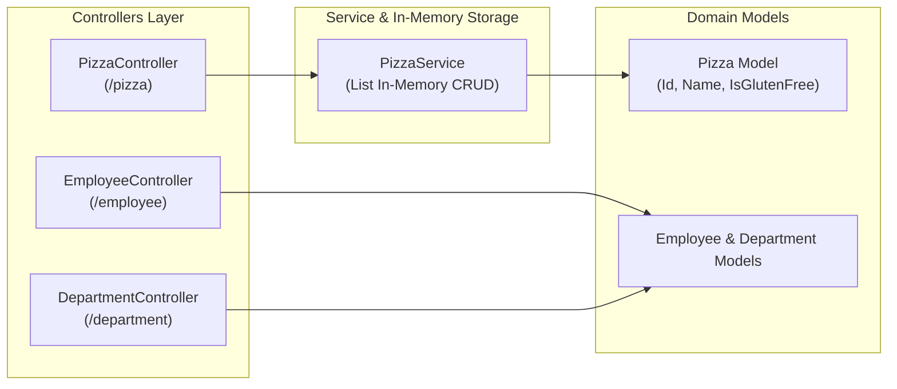

# 💻 ASPClone (ASP.NET Core Web API 연습 명세서)

ASP.NET Core Web API의 Controller-Service-Model 계층화 아키텍처 및 RESTful API 엔드포인트 구현을 실습하기 위한 기초 프로젝트입니다.

---

## 📐 1. 모듈 내부 아키텍처 (Module Architecture)

---

## 📂 하위 README 링크
- **[ASPPractice README 바로가기](./ASPPractice/README.md)**: 피자 및 직원/부서 CRUD 컨트롤러 명세.
