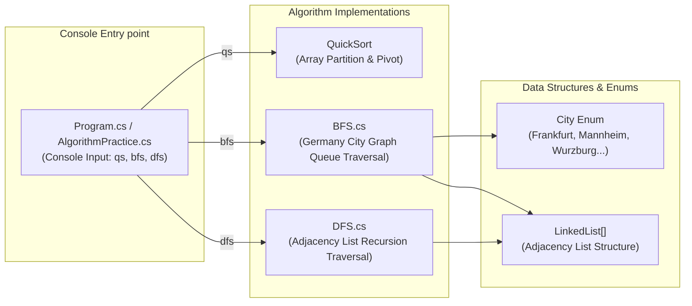

# 📘 CSharpPractice (C# 알고리즘 실습 프로젝트)

C# 환경에서 퀵 정렬(QuickSort), 너비 우선 탐색(BFS - 독일 도시 그래프), 깊이 우선 탐색(DFS) 알고리즘을 구현 및 실습하는 콘솔 프로젝트입니다.

---

## 📐 1. 모듈 내부 아키텍처 (Module Architecture)

---

## 📂 하위 README 링크
- **[CSharpPractice 소스 README 바로가기](./CSharpPractice/README.md)**: 퀵 정렬, BFS, DFS C# 소스 코드 및 실행 명세.

