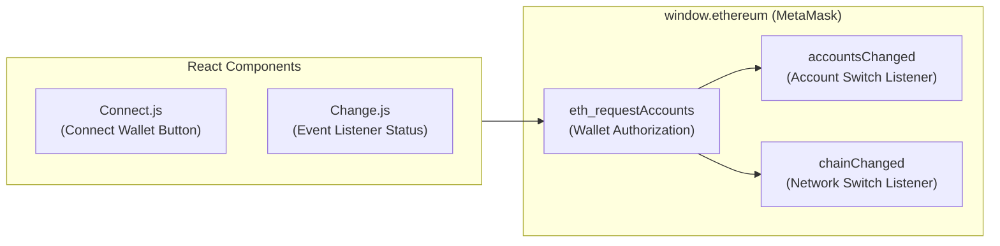

# 🦊 Metamask Template (메타마스크 연동 React 템플릿 명세서)

React 웹 애플리케이션에서 MetaMask 브라우저 확장 프로그램과의 연동, 계정 연결 요청, 실시간 계정 변경(`accountsChanged`) 및 네트워크 체인 변경(`chainChanged`) 이벤트를 처리하는 보일러플레이트 템플릿입니다.

---

## 📐 1. 모듈 내부 아키텍처 (Module Architecture)

---

## 🛠️ 주요 기능 및 이벤트 훅

1. `window.ethereum` Provider 감지 및 지갑 미설치 예외 처리
2. `eth_requestAccounts` 연동을 통한 지갑 주소 연결 및 승인
3. 지갑 계정 변경시 UI 실시간 재렌더링
4. 이더리움 메인넷/테스트넷 체인 ID 변경 이벤트 처리

---

## 📂 하위 README 링크
- **[src README 바로가기](./src/README.md)**: 소스 컴포넌트 이벤트 핸들러 코드 설명.
