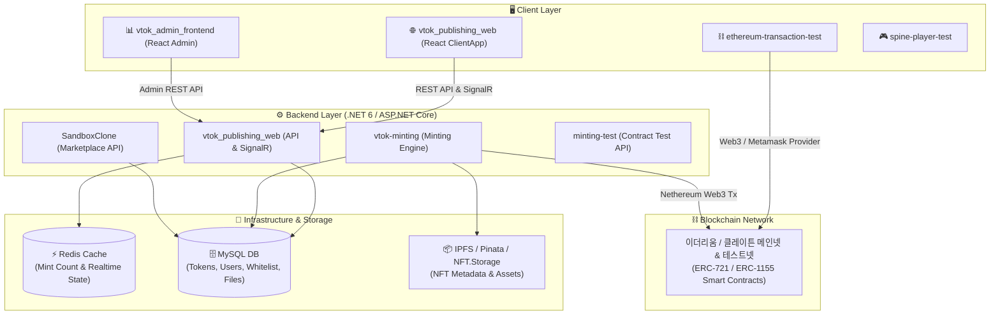

# 🚀 VTOK-ALL 통합 시스템 모노레포 (VTOK Monorepo Platform)

> [!IMPORTANT]
> **🤖 AI Agent 및 개발자를 위한 전용 탐색 지침 (Guidelines for AI Agents & Developers)**
> - 본 저장소는 VTOK(브이톡) NFT 생태계의 메인 웹, 관리자 백오피스, 스마트 컨트랙트 민팅 API, 마켓플레이스 백엔드 및 다양한 Web3/알고리즘 연습 템플릿이 모여 있는 모노레포(Monorepo)입니다.
> - **인공지능(AI Agent) 및 개발자는 코드 수정을 직접 수행하는 목적이 아니라면, 소스 코드를 파일별로 분석할 필요 없이 본 README와 각 서브 프로젝트/하위 디렉토리의 `README.md` 문서만 확인하면 전체 아키텍처와 기능을 완전하게 이해할 수 있습니다.**

---

## 📐 1. 시스템 전체 아키텍처 (System Architecture)

VTOK 플랫폼은 프론트엔드, API 서비스, 캐시/DB 인프라, 분산 저장소(IPFS) 및 블록체인 스마트 컨트랙트 간의 유기적인 연동으로 동작합니다.



---

## 📂 2. 프로젝트 통합 카탈로그 (Project Catalog)

본 저장소에 포함된 12개 프로젝트의 상세 사양과 기술 스택, 담당 역할 및 하위 README 링크 목록입니다.

| 프로젝트 명 | 주요 기능 및 역할 | 핵심 기술 스택 | 하위 README 링크 |
| :--- | :--- | :--- | :---: |
| 🌐 [**vtok_publishing_web**](./vtok_publishing_web) | VTOK 메인 웹사이트, NFT 퍼블리싱, 실시간 카운트다운 타이머 및 민팅 현황 제공 | C#, ASP.NET Core, React, SignalR, Redis | [프로젝트 README](./vtok_publishing_web/README.md) <br> [ClientApp README](./vtok_publishing_web/ClientApp/README.md) |
| 📊 [**vtok_admin_frontend**](./vtok_admin_frontend) | VTOK 관리자 전용 대시보드 (카테고리 트리 관리, 파일 업로드/이력 데이터그리드) | React, Material-UI (MUI Pro DataGrid), Axios | [프로젝트 README](./vtok_admin_frontend/README.md) <br> [src README](./vtok_admin_frontend/src/README.md) |
| ⛏️ [**vtok-minting**](./vtok-minting) | VTOK 메인 NFT 민팅 엔진 (IPFS 메타데이터 업로드 + Nethereum ERC-721 민팅 + DB 저장) | C# (.NET 6), Nethereum, IPFS API, MySQL | [프로젝트 README](./vtok-minting/README.md) <br> [MainApp README](./vtok-minting/MainApplication/README.md) |
| 🧪 [**minting-test**](./minting-test) | ERC-721 / ERC-1155 스마트 컨트랙트 민팅 및 가스비/트랜잭션 테스트 API | C# (.NET 6), Nethereum Web3, MySQL | [프로젝트 README](./minting-test/README.md) <br> [MintingTest README](./minting-test/MintingTest/README.md) |
| ⛓️ [**ethereum-transaction-test**](./ethereum-transaction-test) | 이더리움 잔액 조회, ERC-20/721 전송 및 메타마스크/트러스트월렛 연동 클라이언트 | React, Web3.js, Ethers.js, MetaMask API | [프로젝트 README](./ethereum-transaction-test/README.md) <br> [src README](./ethereum-transaction-test/src/README.md) |
| 🦊 [**Metamask-Template**](./Metamask-Template) | React 서비스용 MetaMask 지갑 연결, 계정/네트워크 이벤트 변경 리스너 템플릿 | React, window.ethereum Provider | [프로젝트 README](./Metamask-Template/README.md) <br> [src README](./Metamask-Template/src/README.md) |
| 🎮 [**spine-player-test**](./spine-player-test) | Spine 2D 애니메이션 캐릭터 렌더링 및 웹 인터랙션 테스트 | React, @esotericsoftware/spine-player | [프로젝트 README](./spine-player-test/README.md) <br> [src README](./spine-player-test/src/README.md) |
| 📦 [**SandboxClone**](./SandboxClone) | 더 샌드박스 스타일 마켓플레이스 백엔드 (NFT 그룹, 장바구니, 유저 관리) | C# (.NET 6), EF Core 6, MySQL | [프로젝트 README](./SandboxClone/README.md) <br> [MainApp README](./SandboxClone/MainApplication/README.md) |
| 💻 [**ASPClone**](./ASPClone) | ASP.NET Core Web API 표준 패턴 실습 프로젝트 (Department, Employee, Pizza CRUD) | C# (.NET 6), ASP.NET Core Web API | [프로젝트 README](./ASPClone/README.md) <br> [ASPPractice README](./ASPClone/ASPPractice/README.md) |
| 📘 [**CSharpPractice**](./CSharpPractice) | C# 10 / .NET 6 그래프 알고리즘 (BFS, DFS) 및 자료구조 실습 코드 | C# 10, .NET 6 Console | [프로젝트 README](./CSharpPractice/README.md) <br> [CSharpPractice README](./CSharpPractice/CSharpPractice/README.md) |
| 🐹 [**go_practice**](./go_practice) | Go (Golang) 언어 입문 및 소켓/HTTP 처리 예제 | Go 1.18+, Standard Library | [프로젝트 README](./go_practice/README.md) <br> [src README](./go_practice/src/README.md) |
| 🐍 [**python_rest_api_practice**](./python_rest_api_practice) | Python Flask 기반 REST API 구축 및 Producer/Consumer 메시징 실습 예제 | Python 3.x / 2.7, Flask, Requests | [프로젝트 README](./python_rest_api_practice/README.md) |

---

## 📋 3. 인수인계 및 개발 환경 구축 가이드 (Setup & Handover Checklist)

### 3.1 필수 전제 조건 (Prerequisites)
- **.NET SDK**: .NET 6.0 SDK 이상
- **Node.js**: v16.x 이상 (npm v8.x 이상)
- **Database**: MySQL 8.0 / MariaDB 10.5 이상
- **In-Memory Cache**: Redis 6.x 이상
- **Browser Extension**: MetaMask 지갑 확장 프로그램

### 3.2 빠른 실행 가이드 (Quick Start)

#### 1) 메인 퍼블리싱 웹 구동 (`vtok_publishing_web`)
```bash
# 백엔드 및 SignalR 서버 구동
cd vtok_publishing_web
dotnet run

# React 프론트엔드 구동 (별도 터미널)
cd vtok_publishing_web/ClientApp
npm install
npm start
```

#### 2) 관리자 대시보드 구동 (`vtok_admin_frontend`)
```bash
cd vtok_admin_frontend
npm install
npm start
```

#### 3) 민팅 백엔드 API 구동 (`vtok-minting`)
```bash
cd vtok-minting/MainApplication
dotnet run
```

---

## 🛠️ 4. 주요 환경 변수 설정 (`appsettings.json`)

백엔드 프로젝트 실행 전 각 프로젝트의 `appsettings.json`에서 아래 설정을 환경에 맞게 수정해야 합니다:

```json
{
  "ConnectionStrings": {
    "DefaultConnection": "Server=localhost;Database=vtok_db;Uid=root;Pwd=your_password;"
  },
  "Redis": {
    "ConnectionString": "localhost:6379"
  },
  "Ethereum": {
    "RpcUrl": "https://mainnet.infura.io/v3/YOUR_INFURA_KEY",
    "PrivateKey": "YOUR_WALLET_PRIVATE_KEY",
    "ContractAddress": "0xYourERC721ContractAddress"
  },
  "IPFS": {
    "NFTStorageApiKey": "YOUR_NFT_STORAGE_API_KEY"
  }
}
```

---

## 💡 5. AI Agent & 개발자 유의 사항

1. **디렉토리별 독립성**: 각 서브 프로젝트는 독립적인 솔루션/패키지 구조를 가집니다.
2. **README 참조 우선 규칙**: 코드를 수정하거나 개별 모듈의 사양을 확인할 때, 해당 디렉토리에 위치한 `README.md` 문서를 먼저 참조하십시오.
