# 🚀 VTOK-ALL 프로젝트 워크스페이스 & 개발자 인수인계 가이드
> **VTOK Multi-Project Workspace Developer Handover Specification**

> [!IMPORTANT]
> **🤖 신규 개발자 및 AI Agent를 위한 인수인계 지침 (Onboarding & Handover Notice)**
> - 본 저장소는 VTOK(브이톡) NFT 웹 생태계 핵심 서비스와 함께 Web3/블록체인 실험, 마켓플레이스 클론, UI/그래픽 템플릿 및 언어 실습 프로젝트가 모여 있는 **멀티 프로젝트 워크스페이스(Multi-Project Workspace)**입니다.
> - **모든 하위 디렉토리는 서로 독립된 프로젝트**로 구성되어 있으며, 각 디렉토리 내부의 `README.md` 문서를 확인하면 개별 소스 코드 수준의 상세 명세를 파악할 수 있습니다.

---

## 🛠️ 1. 개발 환경 요구사항 & 구동 가이드 (Quick Start & Setup)

### 1.1 필수 런타임 & SDK 사양
| 런타임 / 기술 스택 | 권장 버전 | 해당 프로젝트 |
| :--- | :---: | :--- |
| **.NET SDK** | `6.0.x` | `vtok_publishing_web`, `vtok-minting`, `SandboxClone`, `minting-test`, `ASPClone`, `CSharpPractice` |
| **Node.js / npm** | `v16.x` / `v8+` | `vtok_admin_frontend`, `ClientApp`, `ethereum-transaction-test`, `Metamask-Template`, `spine-player-test` |
| **Go** | `1.18+` | `go_practice` |
| **Python** | `3.9+` | `python_rest_api_practice` (`requests` 패키지 필요) |
| **MySQL** | `8.0.x` | `vtok_publishing_web`, `vtok-minting`, `SandboxClone` DB (Port 3306) |
| **Redis** | `6.x+` | `vtok_publishing_web` 실시간 민팅 카운터 & SignalR 캐시 (Port 6379) |

---

## 📐 2. 워크스페이스 프로젝트 구성도 (Workspace Domain Map)

```mermaid
flowchart TB
    subgraph Core ["🌐 VTOK 코어 서비스 (VTOK Core Projects)"]
        direction TB
        PW["🌐 vtok_publishing_web\n(React 17 + ASP.NET Core + SignalR)"]
        AF["📊 vtok_admin_frontend\n(React + MUI DataGrid Pro)"]
        MINT["⛏️ vtok-minting\n(NFT 코어 민팅 엔진 & Web3 API)"]
    end

    subgraph Web3 ["⛓️ Web3 & 블록체인 실험 (Web3 Labs)"]
        direction TB
        ETH_TEST["⛓️ ethereum-transaction-test\n(React + Web3.js 잔액/전송 테스트)"]
        MINT_TEST["🧪 minting-test\n(ERC-721/1155 스마트 컨트랙트 테스트 API)"]
        META_TMPL["🦊 Metamask-Template\n(React 메타마스크 지갑 연동 템플릿)"]
    end

    subgraph Clones ["📦 클론 & 시뮬레이션 프로젝트 (Clone Projects)"]
        direction TB
        SANDBOX["📦 SandboxClone\n(더 샌드박스 스타일 NFT 마켓플레이스 API)"]
        ASP["💻 ASPClone\n(ASP.NET Core Web API 패턴 실습)"]
    end

    subgraph FrontendDemos ["🎮 그래픽 & UI 실습 (UI & Graphics Demos)"]
        direction TB
        SPINE["🎮 spine-player-test\n(React + Spine 2D WebGL 플레이어)"]
    end

    subgraph Learning ["📘 언어 & 백엔드 실습 (Language & Stack Practice)"]
        direction TB
        CSHARP["📘 CSharpPractice\n(C# 알고리즘 QuickSort/BFS/DFS)"]
        GO["🐹 go_practice\n(Go 문법, 포인터, 가변인자 실습)"]
        PYTHON["🐍 python_rest_api_practice\n(Python requests REST API 부하 테스트)"]
    end
```

---

## 📂 3. 인수인계 프로젝트 카탈로그 & 하위 README 내비게이션

| 디렉토리 명 | 주요 역할 및 기술 스택 | 하위 상세 문서 |
| :--- | :--- | :---: |
| 🌐 [**vtok_publishing_web**](./vtok_publishing_web) | VTOK 메인 브랜딩 웹, 사전등록, SignalR 실시간 민팅 카운터 (.NET 6 + React 17) | [백엔드 문서](./vtok_publishing_web/README.md) \| [프론트엔드 문서](./vtok_publishing_web/ClientApp/README.md) |
| 📊 [**vtok_admin_frontend**](./vtok_admin_frontend) | VTOK 운영자 백오피스 어드민 (카테고리 트리 & 파일 이력 데이터그리드) | [프로젝트 문서](./vtok_admin_frontend/README.md) \| [src 문서](./vtok_admin_frontend/src/README.md) |
| ⛏️ [**vtok-minting**](./vtok-minting) | 코어 NFT 민팅 백엔드 엔진 (IPFS + Nethereum Web3 + ERC-721) | [프로젝트 문서](./vtok-minting/README.md) \| [MainApp 문서](./vtok-minting/MainApplication/README.md) |
| 🧪 [**minting-test**](./minting-test) | ERC-721 / ERC-1155 스마트 컨트랙트 트랜잭션 & 가스비 검증 API | [프로젝트 문서](./minting-test/README.md) \| [MintingTest 문서](./minting-test/MintingTest/README.md) |
| ⛓️ [**ethereum-transaction-test**](./ethereum-transaction-test) | 이더리움 잔액 조회 & MetaMask / TrustWallet 전송 테스트 클라이언트 | [프로젝트 문서](./ethereum-transaction-test/README.md) \| [src 문서](./ethereum-transaction-test/src/README.md) |
| 🦊 [**Metamask-Template**](./Metamask-Template) | React용 MetaMask 지갑 연결 & 계정/체인 변경 이벤트 보일러플레이트 | [프로젝트 문서](./Metamask-Template/README.md) \| [src 문서](./Metamask-Template/src/README.md) |
| 🎮 [**spine-player-test**](./spine-player-test) | Spine 2D 캐릭터 자원 WebGL Canvas 렌더링 & 모션 테스트 클라이언트 | [프로젝트 문서](./spine-player-test/README.md) \| [src 문서](./spine-player-test/src/README.md) |
| 📦 [**SandboxClone**](./SandboxClone) | 더 샌드박스 스타일 NFT 마켓플레이스 백엔드 REST API (.NET 6 EF Core) | [프로젝트 문서](./SandboxClone/README.md) \| [MainApp 문서](./SandboxClone/MainApplication/README.md) |
| 💻 [**ASPClone**](./ASPClone) | ASP.NET Core Web API 계층화 아키텍처 패턴 실습 (피자/직원/부서 CRUD) | [프로젝트 문서](./ASPClone/README.md) \| [ASPPractice 문서](./ASPClone/ASPPractice/README.md) |
| 📘 [**CSharpPractice**](./CSharpPractice) | C# 퀵 정렬(QuickSort), 독일 도시 BFS 탐색, 재귀 DFS 알고리즘 실습 | [프로젝트 문서](./CSharpPractice/README.md) \| [CSharpPractice 문서](./CSharpPractice/CSharpPractice/README.md) |
| 🐹 [**go_practice**](./go_practice) | Go 언어 변수/상수, 포인터, 가변 인자 함수, 포맷팅, 루프 기초 실습 | [프로젝트 문서](./go_practice/README.md) \| [src 문서](./go_practice/src/README.md) |
| 🐍 [**python_rest_api_practice**](./python_rest_api_practice) | Python `requests` & `multiprocessing` 기반 REST API 부하 테스트 | [프로젝트 문서](./python_rest_api_practice/README.md) |

---

## 🗄️ 4. 데이터베이스 엔티티 & DbContext 명세

각 독립 백엔드 프로젝트에서 개별적으로 사용하는 MySQL 데이터베이스 테이블 및 ORM 명세입니다.

### 4.1 `vtok_publishing_web` DB (`ApiDataContext`)
- **`SitinAddr` 테이블** (사전 대기열 지갑 주소):
  - `Id` (`INT`, PK Auto-Increment) | `Addr` (`VARCHAR(255)`) | `Count` (`INT`) | `Date` (`VARCHAR(50)`)
- **`MittingAddr` 테이블** (최종 민팅 트랜잭션 승인 내역):
  - `Id` (`INT`, PK Auto-Increment) | `Addr` (`VARCHAR(255)`) | `Tx_id` (`VARCHAR(255)`) | `Value` (`VARCHAR(50)`) | `Count` (`INT`) | `Round` (`INT`) | `Date` (`VARCHAR(50)`)

### 4.2 `vtok-minting` DB (`ApplicationDbContext`)
- **`Tokens` 테이블** (발급된 NFT 토큰): `Contract` (`VARCHAR(255)`, PK1), `Id` (`INT`, PK2), `CreatedDate` (`DATETIME`), `Receiver` (`VARCHAR(255)`), `Received` (`TINYINT(1)`)
- **`Contracts` 테이블** (등록된 스마트 컨트랙트): `Address` (`VARCHAR(255)`, PK), `CreatedDate` (`DATETIME`)
- **`Whitelists` 테이블** (화이트리스트 참가자): `Address` (`VARCHAR(255)`, PK), `Quantity` (`INT`), `CreatedDate` (`DATETIME`)
- **`KeyValues` 테이블** (시스템 설정 키-값 저장소): `Key` (`VARCHAR(255)`, PK), `Value` (`VARCHAR(255)`)

### 4.3 `SandboxClone` DB (`ApplicationDbContext`)
- **`User` 테이블**: `UserId` (`INT`, PK), `Name` (`VARCHAR(255)`), `Email` (`VARCHAR(255)`), `CreatedDateTime` (`DATETIME`)
- **`NFTGroup` 테이블**: `GroupId` (`INT`, PK), `Name` (`VARCHAR(255)`), `Creator` (FK -> `User`), `Description` (`VARCHAR(255)`)
- **`NFT` 테이블**: `TokenId` (`INT`, PK), `Group` (FK -> `NFTGroup`), `Owner` (FK -> `User`), `Price` (`FLOAT`), `OnSale` (`BOOLEAN`)
- **`CartItem` 테이블**: `CartOwner` (`INT`, PK1), `Group` (`INT`, PK2), `Quantity` (`INT`)

---

## 🔌 5. 주요 API 엔드포인트 카탈로그

### 5.1 `vtok_publishing_web` REST API (`ApiControllers/MittingController.cs`)
- `GET /api/time`: 현재 라운드 및 남은 시간 조회
- `GET /api/mitting`: 전체 민팅 라운드 타임테이블 반환
- `GET /api/result`: 민팅 결과 목록 조회
- `GET /api/addr/{id}`: 특정 지갑 주소(`id`)의 화이트리스트 및 차감 가능 수량 반환
- `GET /api/count/{round}`: 라운드 민팅 수량 조회 후 SignalR `Receive("Count", cnt)` 브로드캐스트
- `POST /api/sitin/{id}`: 사전 대기열 신청 수신 Body: `SitinDto` (`{ Addr, Count }`)
- `POST /api/approval/{id}`: 민팅 승인 요청 수신 Body: `MittingDto` (`{ Addr, Tx_id, Value, Count, Round }`)

### 5.2 `vtok-minting` REST API (`Controllers/`)
- `POST /Mint`: Body `NFTMeta` JSON 데이터 수신 ➔ IPFS 업로드 ➔ Nethereum `mint(contractAddress, ipfsUrl)` 트랜잭션 전송 ➔ DB 저장
- `GET /Token`, `POST /Token`, `DELETE /Token`: 토큰 메타데이터 CRUD
- `GET /Whitelist`, `POST /Whitelist`: 화이트리스트 주소 목록 조회 및 수량 추가
- `GET /Contract`: 배포된 스마트 컨트랙트 주소 반환

---

## 🛠️ 6. 스마트 컨트랙트 & Web3 연동 사양

- **Target Ethereum Network**: Ethereum Rinkeby Testnet (`Chain.Rinkeby`)
- **Infura RPC Endpoint**: `https://rinkeby.infura.io/v3/1345b6747e0d4aa0ac47166f5128a4d6`
- **IPFS Pinning Service**: `https://api.nft.storage/upload` (`Bearer {ipfsApiKey}`)
- **Nethereum DTO 매핑**:
  - `ERC721MintFunction`: `[Function("mint")] public string TokenURI { get; set; }`
  - `ERC721OwnerOfFunction`: `[Function("ownerOf")] public BigInteger TokenId { get; set; }`
  - `ERC721MintEventDto`: `[Event("Transfer")]` -> `TokenId` 디코딩 추출

---

## 📋 7. 신규 개발자 인수인계 체크리스트 (Onboarding Checklist)

> [!TIP]
> **인수인계 받은 개발자가 프로젝트를 처음 구동할 때 순서대로 진행하세요:**
> 1. [ ] **DB 및 캐시 인프라 설치**: MySQL 8.0 및 Redis Server를 가동하고 데이터베이스 생성.
> 2. [ ] **VTOK 백엔드 가동**: [`vtok_publishing_web`](./vtok_publishing_web) 및 [`vtok-minting`](./vtok-minting) 디렉토리에서 `dotnet run`으로 백엔드 서버 가동.
> 3. [ ] **VTOK 퍼블리싱 웹 구동**: [`vtok_publishing_web/ClientApp`](./vtok_publishing_web/ClientApp)에서 `npm install` 후 `npm start`로 프론트엔드 접속 (`http://localhost:3000`).
> 4. [ ] **어드민 웹 구동**: [`vtok_admin_frontend`](./vtok_admin_frontend)에서 `npm install` 후 `npm start`로 어드민 대시보드 접속.
> 5. [ ] **Web3 지갑 연동 테스트**: MetaMask 확장을 설치하고 [`Metamask-Template`](./Metamask-Template) 또는 [`ethereum-transaction-test`](./ethereum-transaction-test)를 구동하여 지갑 연결 및 트랜잭션 전송 테스트.
