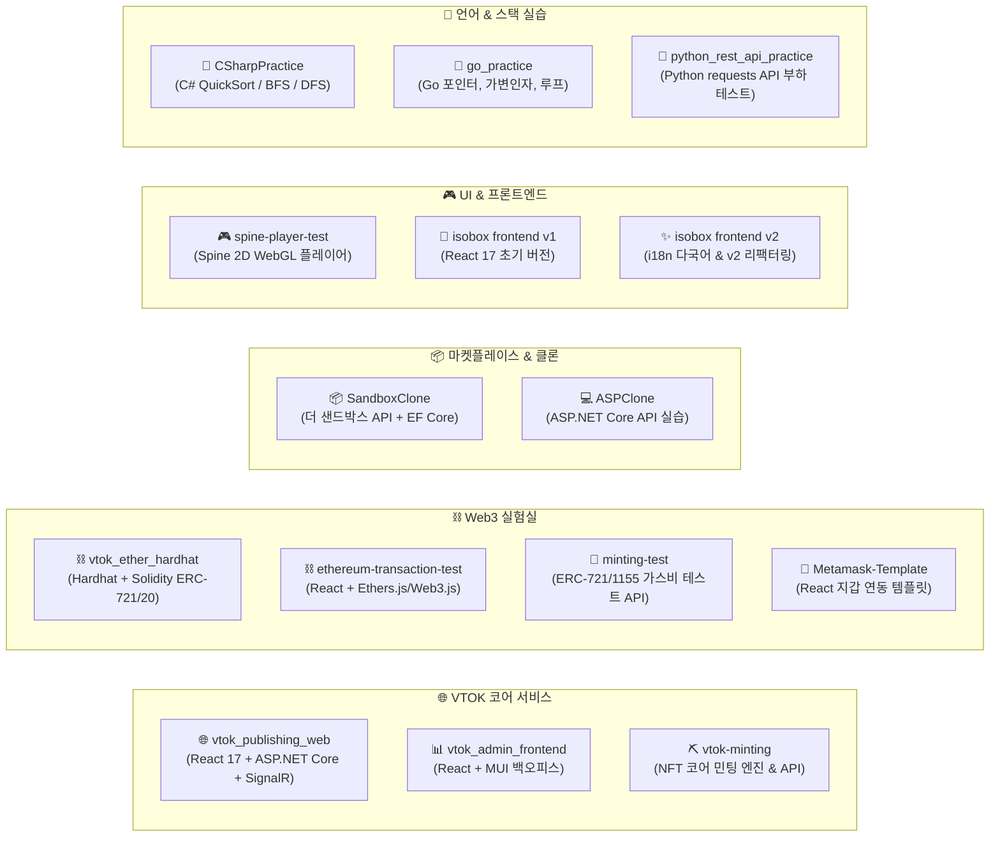
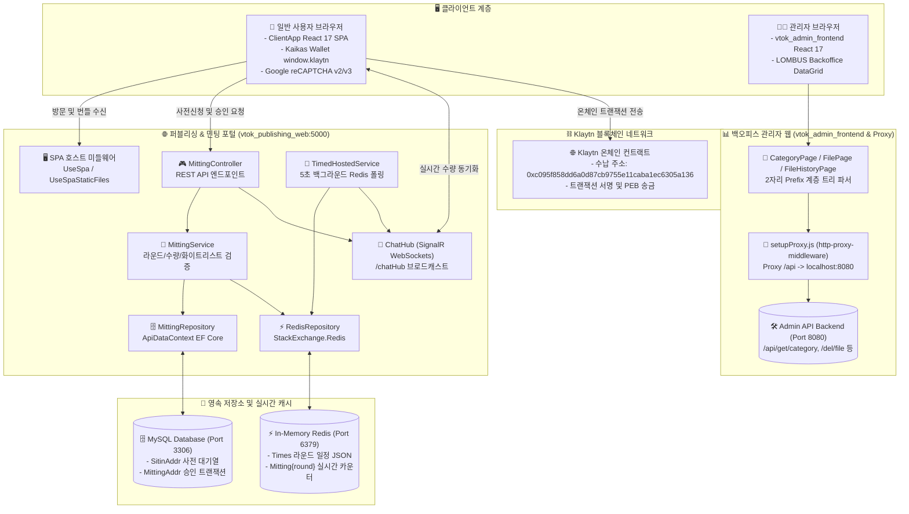
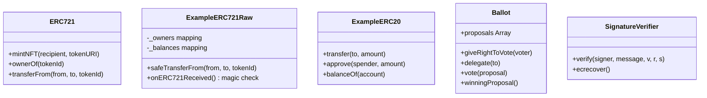
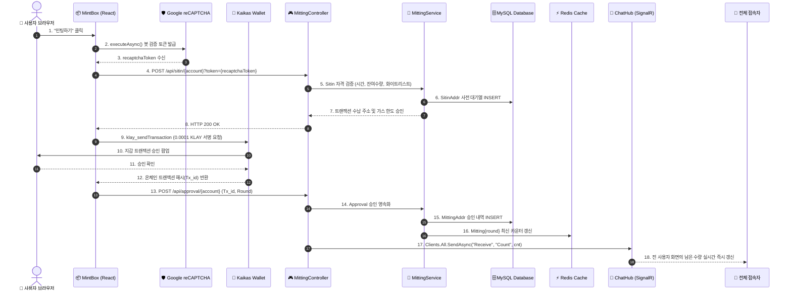

# 🚀 VTOK-ALL 멀티 프로젝트 워크스페이스 종합 지침서
> **VTOK Multi-Project Workspace Architecture Specification**


---

## 📌 목차 (Table of Contents)

1. [📐 워크스페이스 구조 및 아키텍처 맵](#-1-워크스페이스-구조-및-아키텍처-맵)
2. [🛠️ 개발 환경 구축 & 프로젝트 실행 가이드](#️-2-개발-환경-구축--프로젝트-실행-가이드)
3. [📂 12대 프로젝트 카탈로그 & 하위 README 링크](#-3-12대-프로젝트-카탈로그--하위-readme-링크)
4. [🗄️ 데이터베이스 스키마 및 EF Core DbContext 명세](#️-4-데이터베이스-스키마-및-ef-core-dbcontext-명세)
5. [🔌 주요 REST API 엔드포인트 총괄 명세](#-5-주요-rest-api-엔드포인트-총괄-명세)
6. [⛓️ 스마트 컨트랙트 & Web3 연동 사양](#️-6-스마트-컨트랙트--web3-연동-사양)

---

## 📐 1. 워크스페이스 구조 및 아키텍처 맵

전체 저장소는 **5가지 목적별 도메인 그룹**으로 분류되어 있으며, 코어 서비스 간 통합 아키텍처 토폴로지를 갖추고 있습니다.

### 1.1 도메인 그룹 분류도



---

### 1.2 VTOK 코어 서비스 통합 아키텍처 토폴로지 (Core Integrated Topology)

사용자 대면 민팅 포털([`vtok_publishing_web`](./vtok_publishing_web) + [`ClientApp`](./vtok_publishing_web/ClientApp))과 운영자 백오피스([`vtok_admin_frontend`](./vtok_admin_frontend))의 상호 연동 및 인프라 구조도입니다.



---

### 1.3 소스 코드 정밀 분석 핵심 사양 (Deep-Dive Implementation Specs)

1. **`vtok_publishing_web` 백엔드 핵심 비즈니스 로직**:
   - **4대 비즈니스 예외 코드 규격화**:
     - `type: 6`: `"민팅 시간이 아닙니다."` (`time == null`)
     - `type: 1`: `"민팅 수량이 모두 소진되었습니다"` (`cnt >= time.Count`)
     - `type: 3`: `"화이트리스트 대상자가 아닙니다"` (`time.Group == "prive"`일 때 DB 화이트리스트 미조회)
     - `type: 4`: `"내게 남은 수량보다 더 많이 민팅할 수 없습니다"` (`(Approvalcount - Resultcount) - Count < 1`)
   - **Redis 인덱싱 & 백그라운드 감시**: `Times` JSON 스케줄을 Unix Timestamp로 인덱싱하며, `TimedHostedService`가 5초(`TimeSpan.FromSeconds(5)`)마다 상태를 감시하여 `"End"` 발생 시 `ChatHub` 브로드캐스트 후 타이머 `Dispose()`.
2. **`ClientApp` 프론트엔드 Web3 & 수식 구현체**:
   - **Klaytn 잔액 변환**: `klay_getBalance`의 PEB 단위를 `result / 10^18`로 나누어 KLAY 환산.
   - **3-Phase 민팅 트랜잭션**: `gas: 21000`, `value: 100000000000000` peb (0.0001 KLAY), 수납 주소 `0xc095f858dd6a0d87cb9755e11caba1ec6305a136`, Google Invisible reCAPTCHA (`6LfT1H8eAAAAAMydoaaYRj53J7-BiN3eCF8MBtm1`).
   - **3D 하우스 동적 스케일링**: $\text{cal} = (\text{divWidth} \times 0.7 / 664) - 0.2$ 수식을 통한 브라우저 뷰포트 반응형 렌더링.
3. **`vtok_admin_frontend` 백오피스**:
   - **LOMBUS 2자리 계층형 트리 알고리즘**: `strings.codeLength = 2`를 기준으로 Depth 1(길이 2), Depth 2(길이 4) Breadcrumb 추출.
   - **카테고리 삭제 시 하위 항목 재배치**: `line: alert`(삭제 대상), `reline: move`(이관 대상) 파라미터 전달.
   - **리버스 프록시**: `setupProxy.js`를 통해 로컬 8080 포트 Admin API 서버로 `/api` 요청 포워딩.

---

## 🛠️ 2. 개발 환경 구축 & 프로젝트 실행 가이드

### 2.1 기술 스택 및 권장 런타임 사양

| 기술 스택 | 권장 버전 | 적용 프로젝트 |
| :--- | :---: | :--- |
| **.NET SDK** | `6.0.x` | `vtok_publishing_web`, `vtok-minting`, `SandboxClone`, `minting-test`, `ASPClone`, `CSharpPractice` |
| **Node.js / npm** | `v16.x` / `v8+` | `vtok_admin_frontend`, `ClientApp`, `ethereum-transaction-test`, `Metamask-Template`, `spine-player-test` |
| **Go** | `1.18+` | `go_practice` |
| **Python** | `3.9+` | `python_rest_api_practice` |
| **MySQL Database** | `8.0.x` | `vtok_publishing_web`, `vtok-minting`, `SandboxClone` (Port 3306) |
| **Redis Server** | `6.x+` | `vtok_publishing_web` 실시간 민팅 카운터 & SignalR 캐시 (Port 6379) |

---

### 2.2 프로젝트별 실행 CLI 명령어

#### 1) 🌐 VTOK 메인 퍼블리싱 웹 (`vtok_publishing_web`)
```bash
# 백엔드 API 및 SignalR 가동 (.NET 6)
cd vtok_publishing_web
dotnet run

# 프론트엔드 ClientApp 가동 (별도 터미널)
cd ClientApp
npm install
npm start
```

#### 2) ⛏️ VTOK 코어 민팅 엔진 (`vtok-minting`)
```bash
cd vtok-minting
dotnet run
```

#### 3) 📊 VTOK 어드민 백오피스 (`vtok_admin_frontend`)
```bash
cd vtok_admin_frontend
npm install
npm start
```

#### 4) 📦 더 샌드박스 클론 API (`SandboxClone`)
```bash
cd SandboxClone
dotnet run
```

#### 5) 🐍 파이썬 API 부하 테스트 (`python_rest_api_practice`)
```bash
cd python_rest_api_practice
pip install requests
python main.py
```

#### 6) ⛓️ Hardhat 스마트 컨트랙트 환경 (`vtok_ether_hardhat`)
```bash
cd vtok_ether_hardhat
npm install
npx hardhat test
```

---

## 📂 3. 15대 프로젝트 카탈로그 & 하위 README 링크

각 프로젝트 디렉토리 내부에는 소스 코드 및 컨트롤러 단위의 상세 명세서(`README.md`)가 구비되어 있습니다.

| 디렉토리 명 | 역할 및 주요 스택 | 하위 README 바로가기 |
| :--- | :--- | :---: |
| 🌐 [**vtok_publishing_web**](./vtok_publishing_web) | VTOK 메인 브랜딩 웹사이트, 사전 대기열, SignalR 실시간 민팅 현황 (.NET 6 + React 17) | [백엔드 문서](./vtok_publishing_web/README.md) \| [ClientApp 문서](./vtok_publishing_web/ClientApp/README.md) |
| 📊 [**vtok_admin_frontend**](./vtok_admin_frontend) | VTOK 백오피스 어드민 (카테고리 트리 & 파일 작업 로그 데이터그리드) | [어드민 문서](./vtok_admin_frontend/README.md) \| [src 문서](./vtok_admin_frontend/src/README.md) |
| ⛏️ [**vtok-minting**](./vtok-minting) | NFT 코어 민팅 엔진 (IPFS NFT.Storage + Nethereum Web3 + ERC-721) | [민팅 엔진 문서](./vtok-minting/README.md) \| [MainApp 문서](./vtok-minting/MainApplication/README.md) |
| ⛓️ [**vtok_ether_hardhat**](./vtok_ether_hardhat) | Hardhat 기반 Solidity ERC-721/20/1155 스마트 컨트랙트 개발, 테스트 및 Web3 스크립트 | [Hardhat 컨트랙트 문서](./vtok_ether_hardhat/README.md) |
| 🎨 [**isobox frontend v1**](./isobox%20frontend%20v1) | iSOBOX 메인 클라이언트 v1 복사본 (React 17 + MUI v5 + Kaikas 민팅) | [v1 프론트엔드 문서](./isobox%20frontend%20v1/README.md) |
| ✨ [**isobox frontend v2**](./isobox%20frontend%20v2) | iSOBOX 2세대 리팩터링 클라이언트 (i18n 다국어 지원, Contents 모듈화, SNS 연동) | [v2 프론트엔드 문서](./isobox%20frontend%20v2/README.md) |
| 🧪 [**minting-test**](./minting-test) | ERC-721 / ERC-1155 스마트 컨트랙트 트랜잭션 & 가스비 한도 검증 API | [테스트 API 문서](./minting-test/README.md) \| [MintingTest 문서](./minting-test/MintingTest/README.md) |
| ⛓️ [**ethereum-transaction-test**](./ethereum-transaction-test) | 이더리움 잔액 조회 & MetaMask / TrustWallet 전송 테스트 React 어플리케이션 | [지갑 테스트 문서](./ethereum-transaction-test/README.md) \| [src 문서](./ethereum-transaction-test/src/README.md) |
| 🦊 [**Metamask-Template**](./Metamask-Template) | React용 MetaMask 지갑 연결 & 실시간 계정/체인 변경 이벤트 처리 보일러플레이트 | [템플릿 문서](./Metamask-Template/README.md) \| [src 문서](./Metamask-Template/src/README.md) |
| 🎮 [**spine-player-test**](./spine-player-test) | Spine 2D 캐릭터 자원 (.json, .atlas, .png) WebGL Canvas 인터랙티브 플레이어 | [플레이어 문서](./spine-player-test/README.md) \| [src 문서](./spine-player-test/src/README.md) |
| 📦 [**SandboxClone**](./SandboxClone) | 더 샌드박스 마켓플레이스 데이터 모델 (User, NFTGroup, NFT, CartItem) API | [마켓플레이스 문서](./SandboxClone/README.md) \| [MainApp 문서](./SandboxClone/MainApplication/README.md) |
| 💻 [**ASPClone**](./ASPClone) | ASP.NET Core Controller-Service-Model 계층화 패턴 실습 (피자/직원/부서 CRUD) | [실습 문서](./ASPClone/README.md) \| [ASPPractice 문서](./ASPClone/ASPPractice/README.md) |
| 📘 [**CSharpPractice**](./CSharpPractice) | C# 퀵 정렬(QuickSort), 독일 도시 BFS 탐색, 재귀 DFS 알고리즘 실습 | [C# 알고리즘 문서](./CSharpPractice/README.md) \| [소스 문서](./CSharpPractice/CSharpPractice/README.md) |
| 🐹 [**go_practice**](./go_practice) | Go (Golang) 변수/상수 선언, 포인터 연산, 가변 인자 함수, 반복문 기초 실습 | [Go 실습 문서](./go_practice/README.md) \| [src 문서](./go_practice/src/README.md) |
| 🐍 [**python_rest_api_practice**](./python_rest_api_practice) | Python `requests` & `multiprocessing` 기반 REST API 클라이언트 및 부하 테스트 | [파이썬 테스트 문서](./python_rest_api_practice/README.md) |


---

## 🖥️ 4. 전체 화면 및 페이지 (Pages & Views) 매핑 명세

사용자 브라우저에 렌더링되는 프론트엔드 화면, 백오피스 관리자 페이지 및 테스트 뷰 전체 목록입니다. 본 표만으로 각 페이지의 진입 경로, 소스 파일 및 UI 역할을 한눈에 파악할 수 있습니다.

| 프로젝트 | 화면 / 페이지명 | 소스 파일 위치 | 라우트 / URL | 주요 기능 및 인터랙션 |
| :--- | :--- | :--- | :---: | :--- |
| **`vtok_publishing_web`**<br>(ClientApp) | **메인 히어로 & 민팅 포털** | [`Home.js`](./vtok_publishing_web/ClientApp/src/layouts/Main/Home.js) | `/` (`#home`) | • 3D 가상 하우스 및 아바타 인터랙티브 뷰<br>• 실시간 잔여 시간 카운트다운 타이머<br>• Kaikas 지갑 연동 및 구글 reCAPTCHA v3 NFT 민팅 박스 |
| 〃 | **iSOBOX 서비스 소개** | [`Service/index.js`](./vtok_publishing_web/ClientApp/src/layouts/Service/index.js) | `/` (`#isobox`) | • 메타버스 4대 서비스(**Trade, Creation, Housing, Community**) 스와이퍼(Swiper) 탭 전환<br>• 가상 펫(Pet) 시스템 및 세계관 스토리 슬라이드 |
| 〃 | **1st NFT 컬렉션** | [`NFT/index.js`](./vtok_publishing_web/ClientApp/src/layouts/NFT/index.js) | `/` (`#nft`) | • 7개 파츠 조합 '두근두근박스들' 1만 개 아바타 NFT 쇼케이스<br>• 홀더 전용 혜택(거버넌스 투표권, 가상 룸) 소개 |
| 〃 | **팀원 소개 (ABOUT US)** | [`Team/index.js`](./vtok_publishing_web/ClientApp/src/layouts/Team/index.js) | `/` (`#about`) | • CEO, 디렉터, 블록체인 개발자 등 13인 팀원 프로필 카드 및 한 줄 좌우명 캐러셀 |
| 〃 | **로드맵 타임라인** | [`Roadmap/index.js`](./vtok_publishing_web/ClientApp/src/layouts/Roadmap/index.js) | `/` (`#roadmap`) | • 분기별 플랫폼 로드맵(NFT 런칭 ➔ 마켓 오픈 ➔ 커스텀 툴) 타임라인 |
| 〃 | **서버 에러 진단 뷰** | [`Error.cshtml`](./vtok_publishing_web/Pages/Error.cshtml) | `/Error` | • ASP.NET Core 백엔드 예외 발생 시 요청 ID(`RequestId`) 진단 화면 |
| **`vtok_admin_frontend`** | **카테고리 트리 관리** | [`CategoryPage.js`](./vtok_admin_frontend/src/page/CategoryPage.js) | `/` | • 2자리 Prefix 기반 무한 계층 카테고리 트리 생성, 수정, 삭제<br>• LOMBUS 백오피스 데이터그리드 |
| 〃 | **파일 업로드 & 매핑** | [`FilePage.js`](./vtok_admin_frontend/src/page/FilePage.js) | `/file` | • 카테고리별 정적 파일(이미지, 3D 모델) 업로드 및 메타데이터 바인딩 |
| 〃 | **파일 변경 이력 감사** | [`FileHistoryPage.js`](./vtok_admin_frontend/src/page/FileHistoryPage.js) | `/history` | • 관리자 작업 로그, 파일 버전 이력, 다운로드 통계 테이블 |
| **`isobox frontend v2`** | **글로벌 다국어 메인 포털** | [`Main/Home.js`](./isobox%20frontend%20v2/ClientApp/src/layouts/Main/Home.js) | `/` | • 영어/한국어(la-ko/la-en) 원클릭 동적 언어 전환<br>• 특수 타이포그래피(`SpecialTypography`) 기반 2세대 리뉴얼 UI |
| 〃 | **팀 & 어드바이저 뷰** | [`Team/index.js`](./isobox%20frontend%20v2/ClientApp/src/layouts/Team/index.js) | `/` | • MainMember, KeyMember, Advisor(자문단 4인) 계층별 프로필 카드 |
| 〃 | **공식 SNS 연동 그룹** | [`SocialMediaButtonGroup`](./isobox%20frontend%20v2/ClientApp/src/components/SocialMediaButtonGroup) | 하단 고정 | • Discord, Twitter, Telegram, Kakao 채널 원클릭 진입 바 |
| **`ethereum-transaction-test`** | **Web3 지갑 & 송금 테스트** | [`App.js`](./ethereum-transaction-test/src/App.js) | `/` | • MetaMask / TrustWallet 연결<br>• ETH / ERC-20 잔액 조회 및 수신 주소별 트랜잭션 전송 테스트 |
| **`Metamask-Template`** | **메타마스크 보일러플레이트** | [`Main.js`](./Metamask-Template/src/Page/Main.js) | `/` | • 계정 변경(`accountsChanged`), 체인 변경(`chainChanged`) 이벤트 실시간 감지 |
| **`spine-player-test`** | **Spine 2D 플레이어 뷰** | [`App.js`](./spine-player-test/src/App.js) | `/` | • WebGL 캔버스 기반 2D 캐릭터 스파인 애니메이션 스킨/모션 렌더링 |

---

## 🎮 5. 전체 API 컨트롤러 (Controllers & Endpoints) 총괄 명세

백엔드 서버들이 외부에 노출하는 RESTful API 엔드포인트와 내부 비즈니스 로직 총괄 명세입니다.

### 5.1 `vtok_publishing_web` (`ApiControllers/MittingController.cs`)
* **Base Route**: `[Route("api")]`
* **주요 역할**: 실시간 민팅 대기열 관리, 화이트리스트 검증, SignalR 웹소켓 카운트 브로드캐스트

| Method | Endpoint | 파라미터 / DTO | 동작 및 비즈니스 검증 로직 |
| :---: | :--- | :--- | :--- |
| `GET` | `/api/time` | - | 현재 민팅 진행 라운드 정보 및 시작/마감 시각(`Time` 모델) 반환 |
| `GET` | `/api/mitting` | - | 전체 민팅 라운드 스케줄 및 상태 문자열(`"Wait"`, `"Start"`, `"End"`) 반환 |
| `GET` | `/api/result` | - | 최종 민팅 승인 완료자 내역 리스트 반환 |
| `GET` | `/api/addr/{id}` | Path: `{id}` (지갑 주소) | 해당 지갑의 사전 신청 자격 및 잔여 수량 검증 (최대 3개 제한) |
| `GET` | `/api/count/{round}` | Path: `{round}` | Redis에서 해당 라운드 민팅 수량을 조회하고 SignalR `Receive("Count", cnt)`로 전 사용자 브로드캐스트 |
| `POST` | `/api/sitin/{id}` | Path: `{id}`<br>Query: `token`<br>Body: `SitinDto` | Google reCAPTCHA 토큰 검증 ➔ 화이트리스트 확인 ➔ MySQL `SitinAddr` 테이블에 대기열 레코드 삽입 |
| `POST` | `/api/approval/{id}` | Path: `{id}`<br>Body: `MittingDto` | 온체인 트랜잭션 해시(`Tx_id`) 검증 ➔ `MittingAddr` 삽입 ➔ Redis 카운터 증가 ➔ SignalR 브로드캐스트 |

### 5.2 `vtok-minting` (`MainApplication/Controllers/`)
* **주요 역할**: IPFS 분산 저장소 업로드 및 Nethereum을 이용한 온체인 스마트 컨트랙트 직접 민팅

| 컨트롤러 명 | Method | Endpoint | 상세 역할 및 비즈니스 로직 |
| :--- | :---: | :--- | :--- |
| **`MintController`** | `POST` | `/Mint` | 메타데이터 JSON을 **IPFS(NFT.Storage)**에 업로드 ➔ 스마트 컨트랙트의 `mint(tokenURI)` 함수 호출 ➔ DB에 토큰 ID 영속화 |
| **`TokenController`** | `GET` | `/Token` | 컨트랙트에서 온체인 발행된 전체 NFT 토큰 목록 조회 |
| 〃 | `POST` | `/Token` | 신규 발행 토큰 엔티티 수동 추가 (컨트랙트 주소, TokenId 매핑) |
| 〃 | `DELETE` | `/Token` | 지정한 토큰 식별자 엔티티 삭제 |
| **`WhitelistController`** | `GET` | `/Whitelist` | 사전 승인된 화이트리스트 지갑 주소 목록 조회 |
| 〃 | `POST` | `/Whitelist` | 신규 화이트리스트 대상 지갑 주소 DB 등록 |
| **`ContractController`** | `GET` | `/Contract` | 배포되어 시스템에 바인딩된 온체인 스마트 컨트랙트 주소 조회 |
| **`ProcessController`** | `POST` | `/Process` | 배치 비동기 민팅 작업 큐 처리 및 트랜잭션 수수료/상태 모니터링 |
| **`PublicController`** | `GET` | `/Public/Status` | 민팅 엔진 노드 상태 및 이더리움 Rinkeby RPC 프로바이더 연결 상태 헬스체크 |

### 5.3 `SandboxClone` (`MainApplication/Controllers/`)
* **주요 역할**: 더 샌드박스 스타일 복셀 에셋 마켓플레이스 CRUD

| 컨트롤러 명 | Method | Endpoint | 상세 역할 및 비즈니스 로직 |
| :--- | :---: | :--- | :--- |
| **`CartController`** | `GET` | `/Cart` | 특정 사용자(`userId`)의 장바구니 아이템 전체 목록 조회 |
| 〃 | `POST` | `/Cart` | 장바구니에 새 에셋 추가 (`CreatedAtAction("Get", ...)` 201 Created 반환) |
| 〃 | `PUT` | `/Cart` | 장바구니 품목 수량 수정 (`204 NoContent` 반환) |
| 〃 | `DELETE` | `/Cart` | 장바구니에서 특정 품목 삭제 |
| **`NFTController`** | `GET` | `/NFT` | 개별 복셀 NFT 토큰 조회 및 온세일(`OnSale == true`) 필터링 |
| 〃 | `POST` | `/NFT` | 크리에이터의 신규 NFT 에셋 발행 및 리스팅 가격 설정 |
| **`NFTGroupController`** | `GET` | `/NFTGroup` | 에셋 컬렉션 그룹(테마, 카테고리) 목록 및 그룹 상세 조회 |
| **`UserController`** | `GET` | `/User` | 크리에이터 및 일반 유저 프로필, 생성한 에셋 목록 조회 |
| 〃 | `POST` | `/User` | 신규 유저 계정 생성 및 지갑 주소 바인딩 |

### 5.4 `minting-test` & `ASPClone`
* **`minting-test/MintController`**: `POST /api/Mint` - ERC-721 대량 민팅 시 가스 소모량 측정 및 트랜잭션 영수증 반환
* **`minting-test/EthereumController`**: `POST /api/Ethereum/Transfer` - 테스트넷 ETH 직접 송금 트랜잭션 서명 및 논스(Nonce) 테스트
* **`ASPClone/PizzaController`**: `GET /pizza`, `POST /pizza`, `DELETE /pizza/{id}` - 계층화 패턴 실습용 피자 주문 CRUD API

---

## 🗄️ 6. 데이터베이스 스키마 및 영속성 명세

각 백엔드 서비스는 용도에 맞는 독립 MySQL 데이터베이스 구조와 Redis 인메모리 캐시를 가지고 있습니다.

### 6.1 `vtok_publishing_web` 데이터베이스 (`ApiDataContext`)
* **`SitinAddr` 테이블** (사전 등록/대기열 주소)
  | Column Name | Data Type | Key | Description |
  | :--- | :--- | :---: | :--- |
  | `Id` | `INT` | PK (Auto Increment) | 고유 식별자 |
  | `Addr` | `VARCHAR(255)` | - | 신청자 지갑 주소 (`0x...`) |
  | `Count` | `INT` | - | 신청 수량 |
  | `Date` | `VARCHAR(50)` | - | 등록 일시 (`yyyy-MM-dd-HH-mm-ss`) |

* **`MittingAddr` 테이블** (최종 민팅 승인 내역)
  | Column Name | Data Type | Key | Description |
  | :--- | :--- | :---: | :--- |
  | `Id` | `INT` | PK (Auto Increment) | 고유 식별자 |
  | `Addr` | `VARCHAR(255)` | - | 수령 지갑 주소 |
  | `Tx_id` | `VARCHAR(255)` | - | 블록체인 트랜잭션 해시 |
  | `Value` | `VARCHAR(50)` | - | 결제 암호화폐 금액 (ETH / KLAY) |
  | `Count` | `INT` | - | 승인 수량 |
  | `Round` | `INT` | - | 민팅 라운드 |
  | `Date` | `VARCHAR(50)` | - | 승인 일시 |

* **Redis 실시간 캐시**:
  * 키 `Times`: 민팅 라운드 일정 JSON 객체
  * 키 `Mitting{round}`: 실시간 라운드별 잔여 민팅 수량 정수 카운터

---

### 6.2 `SandboxClone` 마켓플레이스 데이터베이스 (`SandboxContext`)
* **`User` 테이블**: `UserId` (`INT`, PK), `Name` (`VARCHAR(255)`), `Email` (`VARCHAR(255)`), `CreatedDateTime` (`DATETIME`)
* **`NFTGroup` 테이블**: `GroupId` (`INT`, PK), `Name` (`VARCHAR(255)`), `Creator` (FK -> `User`), `Description` (`VARCHAR(255)`)
* **`NFT` 테이블**: `TokenId` (`INT`, PK), `Group` (FK -> `NFTGroup`), `Owner` (FK -> `User`), `Price` (`FLOAT`), `OnSale` (`BOOLEAN`)
* **`CartItem` 테이블**: `CartOwner` (`INT`, PK1), `Group` (`INT`, PK2), `Quantity` (`INT`)

---

## ⛓️ 7. 스마트 컨트랙트 (Smart Contracts in `vtok_ether_hardhat`)

`vtok_ether_hardhat` 프로젝트에 내장된 EVM 기반 솔리디티 스마트 컨트랙트 클래스 구조 및 함수 사양입니다.



| 컨트랙트 파일명 | 토큰 규격 / 유형 | 핵심 상태 변수 & 함수 | 아키텍처 상세 설명 |
| :--- | :---: | :--- | :--- |
| **`Example-erc721.sol`** | ERC-721 (NFT) | `mintNFT(recipient, tokenURI)`<br>`_tokenIds (Counters)` | OpenZeppelin 표준 기반으로 IPFS 메타데이터를 개별 토큰에 바인딩하는 대표 NFT 컨트랙트 |
| **`Example-erc721-raw.sol`** | 순수 ERC-721 | `_owners`, `_balances`<br>`safeTransferFrom()` | OpenZeppelin 없이 순수 솔리디티로 `onERC721Received` 매직 넘버 검증, 승인 권한 등을 직접 구현한 로우레벨 컨트랙트 |
| **`Example-erc20.sol`** | ERC-20 (Fungible) | `transfer()`, `approve()`, `balanceOf()` | 플랫폼 유틸리티 토큰 발행용 표준 컨트랙트 |
| **`Ballot.sol`** | 온체인 거버넌스 | `vote()`, `delegate()`, `winningProposal()` | NFT 홀더들이 안건에 투표하거나 의결권을 다른 주소에 위임하는 거버넌스 컨트랙트 |
| **`Example5-fallback.sol`** | 송금 처리기 | `receive()`, `fallback()`, `payable` | 컨트랙트로 직접 송금된 순수 ETH 수신 및 잘못된 함수 호출 트랩 핸들러 |
| **`Example5.sol`** | 프록시 호출 | `delegatecall`, `Caller/Callee` | 호출자의 컨텍스트와 스토리지를 유지한 채 외부 라이브러리 코드를 실행하는 프록시 패턴 |
| **`Example8.sol`** | 암호학적 서명 검증 | `keccak256()`, `ecrecover()`, `(v, r, s)` | 오프체인에서 서명한 메시지를 온체인에서 역산하여 신원을 검증하는 서명 검증 로직 |

---

## 🧩 8. 프론트엔드 핵심 컴포넌트 & 상태 관리 (Core Components)

| 컴포넌트 명 | 위치 경로 | 주요 Props & State | 상세 역할 및 인터랙션 |
| :--- | :--- | :--- | :--- |
| **`MintBox`** | [`MintBox/index.js`](./vtok_publishing_web/ClientApp/src/components/MintBox/index.js) | • State: `collect`, `total`, `left`, `minting`<br>• Props: `account`, `toggle` | • Google reCAPTCHA v3 비가시 봇 검증 실행<br>• Kaikas `klay_sendTransaction` 서명 팝업 트리거<br>• 온체인 Tx 성공 후 백엔드 승인 API 호출 |
| **`CountDownTimer`** | [`CountDownTimer/index.js`](./vtok_publishing_web/ClientApp/src/components/CountDownTimer/index.js) | • State: `timeLeft` (일/시/분/초)<br>• Props: `toggle` | • 민팅 오픈 일시까지 1초 단위 실시간 차감<br>• 마감 도달 시 `toggle()`로 화면을 `MintBox`로 자동 전환 |
| **`HousePreview`** | [`HousePreview/index.js`](./vtok_publishing_web/ClientApp/src/components/HousePreview/index.js) | • State: `scale` (0.7 ~ 1.0)<br>• Hook: `useWindowDimensions` | • 브라우저 폭에 반응하여 3D 방 그래픽 스케일 동적 보정<br>• 룸, 가구, 아바타 GIF 레이어 다중 합성 |
| **`MainAppBar`** | [`MainAppBar/index.js`](./vtok_publishing_web/ClientApp/src/components/MainAppBar/index.js) | • State: `balance`, `account`<br>• Props: `isSticky` | • `window.klaytn.enable()`로 지갑 연결<br>• 스크롤 위치에 따른 글래스모피즘 블러 효과 전환 |
| **`ServiceTabs`** | [`ServiceTabs.js`](./vtok_publishing_web/ClientApp/src/layouts/Service/ServiceTabs.js) | • State: `activeTab` (0: Trade ~ 3: Community) | • 4대 서비스 버튼 클릭 시 Swiper 슬라이드 이동 동기화 |

---

## 🔄 9. 엔드투엔드 민팅 & 실시간 동기화 시퀀스 (End-to-End Workflow)

사용자 브라우저에서 민팅을 시도할 때 백엔드 검증, 블록체인 서명, Redis/MySQL 영속화 및 전 사용자 실시간 동기화까지의 엔드-투-엔드 전체 데이터 흐름입니다.



---

> [!NOTE]
> **개발자를 위한 탐색 지침 (Developer Notice)**
> - 본 저장소는 VTOK(브이톡) NFT 생태계 코어 플랫폼을 포함하여 Web3/블록체인 연동 모듈, 마켓플레이스 클론, 2D 그래픽 렌더러, 프로그래밍 언어 실습 프로젝트가 통합 관리되는 **멀티 프로젝트 워크스페이스(Monorepo Workspace)**입니다.
> - **각 하위 디렉토리는 독립적으로 실행 가능한 프로젝트**로 구성되어 있으며, 본 문서 및 각 하위 프로젝트의 `README.md`를 참고하여 빠르게 환경을 구축하고 소스 코드를 파악할 수 있습니다.
