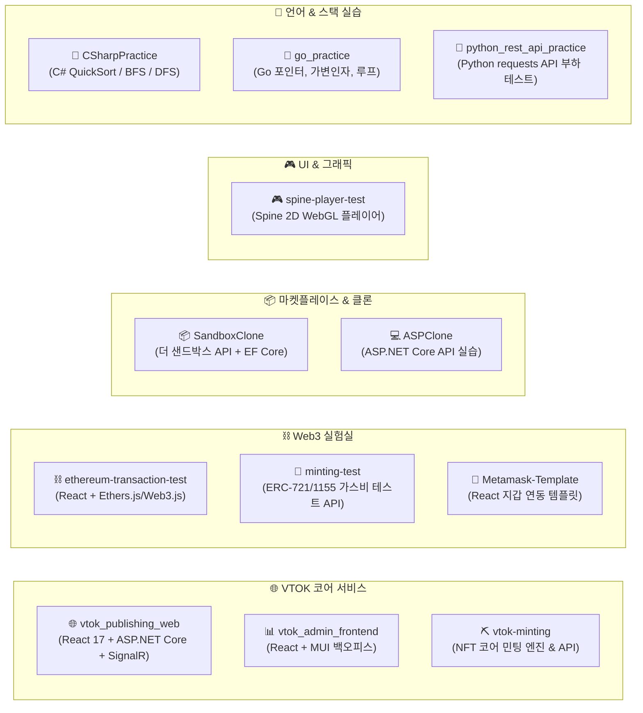

# 🚀 VTOK-ALL 멀티 프로젝트 워크스페이스 종합 지침서
> **VTOK Multi-Project Workspace Architecture Specification**


---

## 📌 목차 (Table of Contents)

1. [📐 워크스페이스 구조 및 아키텍처 맵](#-1-워크스페이스-구조-및-아키텍처-맵)
2. [🛠️ 개발 환경 구축 & 프로젝트 실행 가이드](#️-2-개발-환경-구축--프로젝트-실행-가이드)
3. [📂 12대 프로젝트 카탈로그 & 하위 README 링크](#-3-12대-프로젝트-카탈로그--하위-readme-링크)
4. [🗄️ 데이터베이스 스키마 및 EF Core DbContext 명세](#️-4-데이터베이스-스키마-및-ef-core-dbcontext-명세)
5. [🔌 주요 REST API 엔드포인트 총괄 명세](#-5-주요-rest-api-엔드포인트-총괄-명세)
6. [⛓️ 스마트 컨트랙트 & Web3 연동 사양](#️-6-스마트-컨트랙트--web3-연동-사양)

---

## 📐 1. 워크스페이스 구조 및 아키텍처 맵

전체 저장소는 **5가지 목적별 도메인 그룹**으로 분류되어 있습니다.



---

## 🛠️ 2. 개발 환경 구축 & 프로젝트 실행 가이드

### 2.1 기술 스택 및 권장 런타임 사양

| 기술 스택 | 권장 버전 | 적용 프로젝트 |
| :--- | :---: | :--- |
| **.NET SDK** | `6.0.x` | `vtok_publishing_web`, `vtok-minting`, `SandboxClone`, `minting-test`, `ASPClone`, `CSharpPractice` |
| **Node.js / npm** | `v16.x` / `v8+` | `vtok_admin_frontend`, `ClientApp`, `ethereum-transaction-test`, `Metamask-Template`, `spine-player-test` |
| **Go** | `1.18+` | `go_practice` |
| **Python** | `3.9+` | `python_rest_api_practice` |
| **MySQL Database** | `8.0.x` | `vtok_publishing_web`, `vtok-minting`, `SandboxClone` (Port 3306) |
| **Redis Server** | `6.x+` | `vtok_publishing_web` 실시간 민팅 카운터 & SignalR 캐시 (Port 6379) |

---

### 2.2 프로젝트별 실행 CLI 명령어

#### 1) 🌐 VTOK 메인 퍼블리싱 웹 (`vtok_publishing_web`)
```bash
# 백엔드 API 및 SignalR 가동 (.NET 6)
cd vtok_publishing_web
dotnet run

# 프론트엔드 ClientApp 가동 (별도 터미널)
cd ClientApp
npm install
npm start
```

#### 2) ⛏️ VTOK 코어 민팅 엔진 (`vtok-minting`)
```bash
cd vtok-minting
dotnet run
```

#### 3) 📊 VTOK 어드민 백오피스 (`vtok_admin_frontend`)
```bash
cd vtok_admin_frontend
npm install
npm start
```

#### 4) 📦 더 샌드박스 클론 API (`SandboxClone`)
```bash
cd SandboxClone
dotnet run
```

#### 5) 🐍 파이썬 API 부하 테스트 (`python_rest_api_practice`)
```bash
cd python_rest_api_practice
pip install requests
python main.py
```

---

## 📂 3. 12대 프로젝트 카탈로그 & 하위 README 링크

각 프로젝트 디렉토리 내부에는 소스 코드 및 컨트롤러 단위의 상세 명세서(`README.md`)가 구비되어 있습니다.

| 디렉토리 명 | 역할 및 주요 스택 | 하위 README 바로가기 |
| :--- | :--- | :---: |
| 🌐 [**vtok_publishing_web**](./vtok_publishing_web) | VTOK 메인 브랜딩 웹사이트, 사전 대기열, SignalR 실시간 민팅 현황 (.NET 6 + React 17) | [백엔드 문서](./vtok_publishing_web/README.md) \| [ClientApp 문서](./vtok_publishing_web/ClientApp/README.md) |
| 📊 [**vtok_admin_frontend**](./vtok_admin_frontend) | VTOK 백오피스 어드민 (카테고리 트리 & 파일 작업 로그 데이터그리드) | [어드민 문서](./vtok_admin_frontend/README.md) \| [src 문서](./vtok_admin_frontend/src/README.md) |
| ⛏️ [**vtok-minting**](./vtok-minting) | NFT 코어 민팅 엔진 (IPFS NFT.Storage + Nethereum Web3 + ERC-721) | [민팅 엔진 문서](./vtok-minting/README.md) \| [MainApp 문서](./vtok-minting/MainApplication/README.md) |
| 🧪 [**minting-test**](./minting-test) | ERC-721 / ERC-1155 스마트 컨트랙트 트랜잭션 & 가스비 한도 검증 API | [테스트 API 문서](./minting-test/README.md) \| [MintingTest 문서](./minting-test/MintingTest/README.md) |
| ⛓️ [**ethereum-transaction-test**](./ethereum-transaction-test) | 이더리움 잔액 조회 & MetaMask / TrustWallet 전송 테스트 React 어플리케이션 | [지갑 테스트 문서](./ethereum-transaction-test/README.md) \| [src 문서](./ethereum-transaction-test/src/README.md) |
| 🦊 [**Metamask-Template**](./Metamask-Template) | React용 MetaMask 지갑 연결 & 실시간 계정/체인 변경 이벤트 처리 보일러플레이트 | [템플릿 문서](./Metamask-Template/README.md) \| [src 문서](./Metamask-Template/src/README.md) |
| 🎮 [**spine-player-test**](./spine-player-test) | Spine 2D 캐릭터 자원 (.json, .atlas, .png) WebGL Canvas 인터랙티브 플레이어 | [플레이어 문서](./spine-player-test/README.md) \| [src 문서](./spine-player-test/src/README.md) |
| 📦 [**SandboxClone**](./SandboxClone) | 더 샌드박스 마켓플레이스 데이터 모델 (User, NFTGroup, NFT, CartItem) API | [마켓플레이스 문서](./SandboxClone/README.md) \| [MainApp 문서](./SandboxClone/MainApplication/README.md) |
| 💻 [**ASPClone**](./ASPClone) | ASP.NET Core Controller-Service-Model 계층화 패턴 실습 (피자/직원/부서 CRUD) | [실습 문서](./ASPClone/README.md) \| [ASPPractice 문서](./ASPClone/ASPPractice/README.md) |
| 📘 [**CSharpPractice**](./CSharpPractice) | C# 퀵 정렬(QuickSort), 독일 도시 BFS 탐색, 재귀 DFS 알고리즘 실습 | [C# 알고리즘 문서](./CSharpPractice/README.md) \| [소스 문서](./CSharpPractice/CSharpPractice/README.md) |
| 🐹 [**go_practice**](./go_practice) | Go (Golang) 변수/상수 선언, 포인터 연산, 가변 인자 함수, 반복문 기초 실습 | [Go 실습 문서](./go_practice/README.md) \| [src 문서](./go_practice/src/README.md) |
| 🐍 [**python_rest_api_practice**](./python_rest_api_practice) | Python `requests` & `multiprocessing` 기반 REST API 클라이언트 및 부하 테스트 | [파이썬 테스트 문서](./python_rest_api_practice/README.md) |

---

## 🗄️ 4. 데이터베이스 스키마 및 EF Core DbContext 명세

각 백엔드 서비스는 용도에 맞는 독립 MySQL 데이터베이스 구조를 가지고 있습니다.

### 4.1 `vtok_publishing_web` 데이터베이스 (`ApiDataContext`)

* **`SitinAddr` 테이블** (사전 등록/대기열 주소)
  | Column Name | Data Type | Key | Description |
  | :--- | :--- | :---: | :--- |
  | `Id` | `INT` | PK (Auto Increment) | 고유 식별자 |
  | `Addr` | `VARCHAR(255)` | - | 신청자 지갑 주소 (`0x...`) |
  | `Count` | `INT` | - | 신청 수량 |
  | `Date` | `VARCHAR(50)` | - | 등록 일시 (`yyyy-MM-dd-HH-mm-ss`) |

* **`MittingAddr` 테이블** (최종 민팅 승인 내역)
  | Column Name | Data Type | Key | Description |
  | :--- | :--- | :---: | :--- |
  | `Id` | `INT` | PK (Auto Increment) | 고유 식별자 |
  | `Addr` | `VARCHAR(255)` | - | 수령 지갑 주소 |
  | `Tx_id` | `VARCHAR(255)` | - | 블록체인 트랜잭션 해시 |
  | `Value` | `VARCHAR(50)` | - | 결제 암호화폐 금액 (ETH / KLAY) |
  | `Count` | `INT` | - | 민팅 승인 수량 |
  | `Round` | `INT` | - | 민팅 라운드 |
  | `Date` | `VARCHAR(50)` | - | 승인 완료 일시 |

---

### 4.2 `vtok-minting` 데이터베이스 (`ApplicationDbContext`)

* **`Tokens` 테이블** (NFT 발급 이력 - 복합 키)
  | Column Name | Data Type | Key | Description |
  | :--- | :--- | :---: | :--- |
  | `Contract` | `VARCHAR(255)` | PK (Order 1) | 스마트 컨트랙트 주소 |
  | `Id` | `INT` | PK (Order 2) | 온체인 토큰 ID (Token ID) |
  | `CreatedDate` | `DATETIME` | - | 발행 일시 |
  | `Receiver` | `VARCHAR(255)` | NULL | 수령인 지갑 주소 |
  | `Received` | `TINYINT(1)` | - | 수령 완료 여부 (Boolean) |

* **`Contracts` 테이블**: `Address` (`VARCHAR(255)`, PK), `CreatedDate` (`DATETIME`)
* **`Whitelists` 테이블**: `Address` (`VARCHAR(255)`, PK), `Quantity` (`INT`), `CreatedDate` (`DATETIME`)
* **`KeyValues` 테이블**: `Key` (`VARCHAR(255)`, PK), `Value` (`VARCHAR(255)`)

---

### 4.3 `SandboxClone` 데이터베이스 (`ApplicationDbContext`)

* **`User` 테이블**: `UserId` (`INT`, PK), `Name` (`VARCHAR(255)`), `Email` (`VARCHAR(255)`), `CreatedDateTime` (`DATETIME`)
* **`NFTGroup` 테이블**: `GroupId` (`INT`, PK), `Name` (`VARCHAR(255)`), `Creator` (FK -> `User`), `Description` (`VARCHAR(255)`)
* **`NFT` 테이블**: `TokenId` (`INT`, PK), `Group` (FK -> `NFTGroup`), `Owner` (FK -> `User`), `Price` (`FLOAT`), `OnSale` (`BOOLEAN`)
* **`CartItem` 테이블**: `CartOwner` (`INT`, PK1), `Group` (`INT`, PK2), `Quantity` (`INT`)

---

## 🔌 5. 주요 REST API 엔드포인트 총괄 명세

### 5.1 `vtok_publishing_web` Web API (`ApiControllers/MittingController.cs`)

| Method | Endpoint | Request Body / Query | Return / Action Description |
| :--- | :--- | :--- | :--- |
| `GET` | `/api/time` | - | 현재 민팅 라운드 및 남은 시각 (`Time` DTO) 조회 |
| `GET` | `/api/mitting` | - | 전체 민팅 라운드 일시 및 진행 상태 문자열 반환 |
| `GET` | `/api/result` | - | 민팅 최종 결과 리스트 반환 |
| `GET` | `/api/addr/{id}` | Path `{id}` (지갑 주소) | 해당 지갑의 민팅 허용 수량 및 수량 차감 검증 |
| `GET` | `/api/count/{round}` | Path `{round}` (라운드 번호) | 라운드 수량 조회 및 SignalR `Receive("Count", cnt)` 브로드캐스트 |
| `POST` | `/api/sitin/{id}` | `SitinDto` (`{ Addr, Count }`) | 사전 신청 대기열 DB 저장 |
| `POST` | `/api/approval/{id}` | `MittingDto` (`{ Addr, Tx_id, Value, Count, Round }`) | 민팅 승인 처리, 수량 차감 및 SignalR 브로드캐스트 |

---

### 5.2 `vtok-minting` Web API (`Controllers/`)

| Method | Endpoint | Request Body / Query | Description |
| :--- | :--- | :--- | :--- |
| `POST` | `/Mint` | Query: `contractAddress`, `quantity`<br>Body: `NFTMeta` JSON | IPFS 업로드 ➔ Nethereum ERC-721 `mint` 실행 ➔ DB 저장 |
| `GET` | `/Token` | - | 전체 발급 토큰 목록 반환 |
| `POST` | `/Token` | Query: `contractAddress`, `tokenId` | 신규 토큰 엔티티 추가 |
| `DELETE` | `/Token` | Query: `contractAddress`, `tokenId` | 토큰 엔티티 삭제 |
| `GET` / `POST` | `/Whitelist` | Body: `Whitelist` DTO | 화이트리스트 주소 목록 조회 및 신규 추가 |
| `GET` | `/Contract` | - | 배포 등록된 스마트 컨트랙트 주소 조회 |

---

## ⛓️ 6. 스마트 컨트랙트 & Web3 연동 사양

- **RPC Provider**: Infura Rinkeby Testnet (`https://rinkeby.infura.io/v3/1345b6747e0d4aa0ac47166f5128a4d6`)
- **Target Network**: Ethereum Rinkeby (`Chain.Rinkeby`)
- **IPFS Pinning API**: NFT.Storage (`https://api.nft.storage/upload`, `Bearer Token`)
- **Nethereum Solidity Mapping DTOs**:
  - `ERC721MintFunction`: `[Function("mint")] public string TokenURI { get; set; }`
  - `ERC721OwnerOfFunction`: `[Function("ownerOf")] public BigInteger TokenId { get; set; }`
  - `ERC721MintEventDto`: `[Event("Transfer")]` -> `TokenId` 이벤트를 통한 수령 디코딩

---

> [!NOTE]
> **🤖 개발자 및 AI Agent를 위한 탐색 지침 (Developer & AI Agent Notice)**
> - 본 저장소는 VTOK(브이톡) NFT 생태계 코어 플랫폼을 포함하여 Web3/블록체인 연동 모듈, 마켓플레이스 클론, 2D 그래픽 렌더러, 프로그래밍 언어 실습 프로젝트가 통합 관리되는 **멀티 프로젝트 워크스페이스(Monorepo Workspace)**입니다.
> - **각 하위 디렉토리는 독립적으로 실행 가능한 프로젝트**로 구성되어 있으며, 본 문서 및 각 하위 프로젝트의 `README.md`를 참고하여 빠르게 환경을 구축하고 소스 코드를 파악할 수 있습니다.
