# 🚀 VTOK-ALL 프로젝트 워크스페이스 (VTOK Multi-Project Workspace)

> [!IMPORTANT]
> **🤖 AI Agent 및 개발자를 위한 탐색 및 코드 수정 지침 (AI Agent & Developer Notice)**
> - 본 저장소는 VTOK(브이톡) 서비스 코어를 비롯해 Web3/블록체인 실험, UI/그래픽 템플릿, 마켓플레이스 클론 및 프로그래밍 언어 학습 프로젝트들이 포함된 **멀티 프로젝트 워크스페이스(Monorepo Workspace)**입니다.
> - **각 하위 디렉토리는 서로 독립된 프로젝트로 구성되어 있으며**, 각 프로젝트의 `README.md` 문서를 통해 세부 데이터베이스 구조, API 엔드포인트, 스마트 컨트랙트 사양을 확인할 수 있습니다.

---

## 📐 1. 워크스페이스 프로젝트 구성도 (Workspace Architecture & Domain Map)

```mermaid
flowchart TB
    subgraph Core ["🌐 VTOK 관련 프로젝트 (VTOK Core Projects)"]
        direction TB
        PW["🌐 vtok_publishing_web\n(React 17 + ASP.NET Core + SignalR)"]
        AF["📊 vtok_admin_frontend\n(React + MUI DataGrid Pro)"]
        MINT["⛏️ vtok-minting\n(NFT 코어 민팅 엔진 & Web3 API)"]
    end

    subgraph Web3 ["⛓️ Web3 & 블록체인 실험 (Web3 Labs)"]
        direction TB
        ETH_TEST["⛓️ ethereum-transaction-test\n(React + Web3.js 잔액/전송 테스트)"]
        MINT_TEST["🧪 minting-test\n(ERC-721/1155 스마트 컨트랙트 테스트 API)"]
        META_TMPL["🦊 Metamask-Template\n(React 메타마스크 지갑 연동 템플릿)"]
    end

    subgraph Clones ["📦 클론 & 시뮬레이션 프로젝트 (Clone Projects)"]
        direction TB
        SANDBOX["📦 SandboxClone\n(더 샌드박스 스타일 NFT 마켓플레이스 API)"]
        ASP["💻 ASPClone\n(ASP.NET Core Web API 패턴 실습)"]
    end

    subgraph FrontendDemos ["🎮 그래픽 & UI 실습 (UI & Graphics Demos)"]
        direction TB
        SPINE["🎮 spine-player-test\n(React + Spine 2D WebGL 플레이어)"]
    end

    subgraph Learning ["📘 언어 & 백엔드 실습 (Language & Stack Practice)"]
        direction TB
        CSHARP["📘 CSharpPractice\n(C# 알고리즘 & 자료구조)"]
        GO["🐹 go_practice\n(Go 백엔드 기초 예제)"]
        PYTHON["🐍 python_rest_api_practice\n(Python Flask REST API)"]
    end
```

---

## 🗄️ 2. 데이터베이스 테이블 스키마 총괄 (Database Schema Reference)

각 독립 백엔드 프로젝트(`vtok_publishing_web`, `vtok-minting`, `SandboxClone`)에서 개별적으로 사용하는 MySQL 데이터베이스 테이블 및 칼럼 명세입니다.

### 2.1 `vtok_publishing_web` 데이터베이스 (`ApiDataContext`)
- **`SitinAddr` 테이블** (사전 등록/대기열 지갑 주소):
  | Column Name | Data Type | Key | Description |
  | :--- | :--- | :---: | :--- |
  | `Id` | `INT` | PK (Auto Increment) | 고유 레코드 식별자 |
  | `Addr` | `VARCHAR(255)` | - | 신청자 이더리움/지갑 주소 (`0x...`) |
  | `Count` | `INT` | - | 신청한 민팅 수량 |
  | `Date` | `VARCHAR(50)` | - | 등록 일시 (`yyyy-MM-dd-HH-mm-ss`) |

- **`MittingAddr` 테이블** (최종 민팅 트랜잭션 수락 주소):
  | Column Name | Data Type | Key | Description |
  | :--- | :--- | :---: | :--- |
  | `Id` | `INT` | PK (Auto Increment) | 고유 레코드 식별자 |
  | `Addr` | `VARCHAR(255)` | - | 민팅 지갑 주소 |
  | `Tx_id` | `VARCHAR(255)` | - | 블록체인 트랜잭션 해시 (Transaction Hash) |
  | `Value` | `VARCHAR(50)` | - | 지불된 암호화폐 금액 (ETH / KLAY) |
  | `Count` | `INT` | - | 승인된 민팅 수량 |
  | `Round` | `INT` | - | 민팅 진행 회차 (1차, 2차 등) |
  | `Date` | `VARCHAR(50)` | - | 승인 완료 일시 |

### 2.2 `vtok-minting` 데이터베이스 (`ApplicationDbContext`)
- **`Tokens` 테이블** (발급된 NFT 토큰 복합 키):
  | Column Name | Data Type | Key | Description |
  | :--- | :--- | :---: | :--- |
  | `Contract` | `VARCHAR(255)` | PK (Order 1) | 스마트 컨트랙트 계약 주소 |
  | `Id` | `INT` | PK (Order 2) | 온체인 토큰 ID (Token ID) |
  | `CreatedDate` | `DATETIME` | - | 토큰 생성이력 일시 |
  | `Receiver` | `VARCHAR(255)` | NULL | 수령인 지갑 주소 |
  | `Received` | `TINYINT(1)` | - | 수령 완료 여부 (Boolean) |

- **`Contracts` 테이블** (등록된 스마트 컨트랙트):
  | Column Name | Data Type | Key | Description |
  | :--- | :--- | :---: | :--- |
  | `Address` | `VARCHAR(255)` | PK | 스마트 컨트랙트 배포 주소 |
  | `CreatedDate` | `DATETIME` | - | 등록 일시 |

- **`Whitelists` 테이블** (화이트리스트 참가자):
  | Column Name | Data Type | Key | Description |
  | :--- | :--- | :---: | :--- |
  | `Address` | `VARCHAR(255)` | PK | 지갑 주소 |
  | `Quantity` | `INT` | - | 허용된 최대 민팅 수량 |
  | `CreatedDate` | `DATETIME` | - | 등록 일시 |

- **`KeyValues` 테이블** (시스템 설정 키-값 저장소):
  | Column Name | Data Type | Key | Description |
  | :--- | :--- | :---: | :--- |
  | `Key` | `VARCHAR(255)` | PK | 설정 키 (예: `price`, `minting_state`) |
  | `Value` | `VARCHAR(255)` | - | 설정 값 |

### 2.3 `SandboxClone` 데이터베이스 (`ApplicationDbContext`)
- **`User`**: `UserId` (PK), `Name`, `Email`, `CreatedDateTime`
- **`NFTGroup`**: `GroupId` (PK), `Name`, `Creator` (FK -> User), `Description`
- **`NFT`**: `TokenId` (PK), `Group` (FK -> NFTGroup), `Owner` (FK -> User), `Price` (float), `OnSale` (bool)
- **`CartItem`**: `CartOwner` (PK1), `Group` (PK2), `Quantity` (int)

---

## 🔌 3. 주요 API 엔드포인트 총괄 명세 (API Catalog)

### 3.1 `vtok_publishing_web` Web API (`ApiControllers/MittingController.cs`)
- `GET /api/time`: 현재 라운드 및 남은 시간 조회 (`Time` 객체 반환)
- `GET /api/mitting`: 민팅 라운드 정보 및 일정 반환
- `GET /api/result`: 민팅 결과 목록 조회
- `GET /api/addr/{id}`: 지갑 주소 (`id`) 검증 결과 반환
- `GET /api/count/{round}`: 특정 라운드의 현재 민팅 수량 카운트 반환 및 SignalR `Receive("Count", cnt)` 브로드캐스트
- `POST /api/sitin/{id}`: Body `SitinDto` (`{ Addr, Count }`) 신청 수신
- `POST /api/approval/{id}`: Body `MittingDto` (`{ Addr, Tx_id, Value, Count, Round }`) 민팅 승인 및 수량 차감

### 3.2 `vtok-minting` Web API (`Controllers/`)
- `POST /Mint`: Body `NFTMeta` JSON 데이터 수신 -> IPFS 업로드 -> Nethereum 스마트 컨트랙트 `mint(contractAddress, ipfsUrl)` 실행 후 DB 저장
- `GET /Token`: 전체 토큰 내역 반환
- `POST /Token?contractAddress={addr}&tokenId={id}`: 토큰 추가
- `DELETE /Token?contractAddress={addr}&tokenId={id}`: 토큰 삭제
- `GET /Whitelist`, `POST /Whitelist`: 화이트리스트 주소 등록 및 조회
- `GET /Contract`: 등록된 컨트랙트 정보 반환

---

## 🛠️ 4. 스마트 컨트랙트 연동 사양 (`Constants.cs` & Nethereum)

- **RPC Endpoint**: `https://rinkeby.infura.io/v3/1345b6747e0d4aa0ac47166f5128a4d6`
- **Target Network**: Ethereum Rinkeby Testnet (`Chain.Rinkeby`)
- **IPFS Pinning API**: `https://api.nft.storage/upload` (`Bearer {ipfsApiKey}`)
- **Solidity Function Mapping DTOs**:
  - `ERC721MintFunction`: `[Function("mint")] public string TokenURI { get; set; }`
  - `ERC721OwnerOfFunction`: `[Function("ownerOf")] public BigInteger TokenId { get; set; }`
  - `ERC721ContractOwnerFunction`: `[Function("owner")]`
  - `ERC721MintEventDto`: `[Event("Transfer")]` -> `TokenId` 디코딩 추출

---

## 📂 5. 프로젝트 카탈로그 & 하위 README 링크

| 디렉토리 명 | 설명 및 스택 | 하위 README |
| :--- | :--- | :---: |
| 🌐 [**vtok_publishing_web**](./vtok_publishing_web) | VTOK 메인 웹사이트 & SignalR 실시간 민팅 현황 | [바로가기](./vtok_publishing_web/README.md) \| [ClientApp](./vtok_publishing_web/ClientApp/README.md) |
| 📊 [**vtok_admin_frontend**](./vtok_admin_frontend) | VTOK 관리자 백오피스 (카테고리 트리 & 파일 이력) | [바로가기](./vtok_admin_frontend/README.md) \| [src](./vtok_admin_frontend/src/README.md) |
| ⛏️ [**vtok-minting**](./vtok-minting) | NFT 코어 민팅 엔진 (IPFS + Nethereum Web3) | [바로가기](./vtok-minting/README.md) \| [MainApp](./vtok-minting/MainApplication/README.md) |
| 🧪 [**minting-test**](./minting-test) | ERC-721 / ERC-1155 스마트 컨트랙트 테스트 API | [바로가기](./minting-test/README.md) \| [MintingTest](./minting-test/MintingTest/README.md) |
| ⛓️ [**ethereum-transaction-test**](./ethereum-transaction-test) | 이더리움 잔액 조회 & ERC-20/721 전송 클라이언트 | [바로가기](./ethereum-transaction-test/README.md) \| [src](./ethereum-transaction-test/src/README.md) |
| 🦊 [**Metamask-Template**](./Metamask-Template) | React용 MetaMask 지갑 연결 & 이벤트 템플릿 | [바로가기](./Metamask-Template/README.md) \| [src](./Metamask-Template/src/README.md) |
| 🎮 [**spine-player-test**](./spine-player-test) | Spine 2D 캐릭터 WebGL 플레이어 테스트 | [바로가기](./spine-player-test/README.md) \| [src](./spine-player-test/src/README.md) |
| 📦 [**SandboxClone**](./SandboxClone) | 더 샌드박스 스타일 마켓플레이스 백엔드 API | [바로가기](./SandboxClone/README.md) \| [MainApp](./SandboxClone/MainApplication/README.md) |
| 💻 [**ASPClone**](./ASPClone) | ASP.NET Core Web API 기초 패턴 실습 | [바로가기](./ASPClone/README.md) \| [ASPPractice](./ASPClone/ASPPractice/README.md) |
| 📘 [**CSharpPractice**](./CSharpPractice) | C# 알고리즘 (QuickSort, BFS, DFS) 구현 실습 | [바로가기](./CSharpPractice/README.md) \| [CSharpPractice](./CSharpPractice/CSharpPractice/README.md) |
| 🐹 [**go_practice**](./go_practice) | Go (Golang) 기초 문법, 포인터 및 함수 실습 | [바로가기](./go_practice/README.md) \| [src](./go_practice/src/README.md) |
| 🐍 [**python_rest_api_practice**](./python_rest_api_practice) | Python requests 기반 REST API 연동 및 부하 테스트 | [바로가기](./python_rest_api_practice/README.md) |
