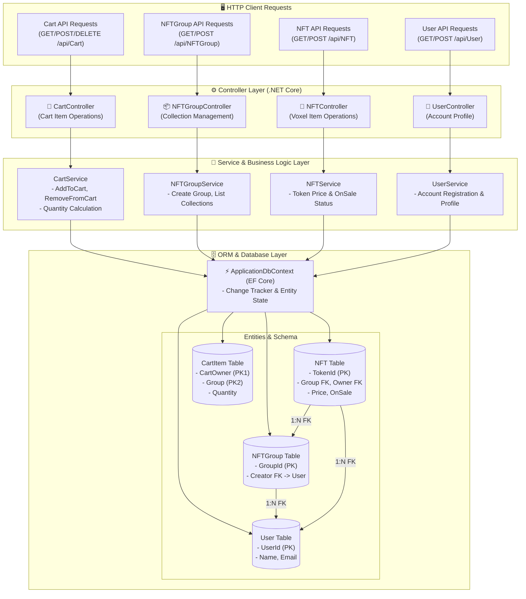

# 📦 SandboxClone (더 샌드박스 마켓플레이스 백엔드 API 명세서)

더 샌드박스(The Sandbox) 마켓플레이스의 데이터 모델 및 백엔드 API 아키텍처를 벤치마크하여 개발한 백엔드 서비스입니다.

---

## 📐 1. 모듈 내부 상세 아키텍처 (Detailed Module Architecture)

---

## 🗄️ 데이터베이스 엔티티 상세 스키마 (`ApplicationDbContext`)

1. **`User` 테이블** (사용자):
   - `UserId` (`INT`, Primary Key, Auto Increment)
   - `Name` (`VARCHAR(255)`, Required)
   - `Email` (`VARCHAR(255)`, Required)
   - `CreatedDateTime` (`DATETIME`): 생성일시

2. **`NFTGroup` 테이블** (컬렉션/그룹):
   - `GroupId` (`INT`, Primary Key, Auto Increment)
   - `Name` (`VARCHAR(255)`, Required)
   - `Creator` (`User` 엔티티, Required FK)
   - `Description` (`VARCHAR(255)`)

3. **`NFT` 테이블** (개별 복셀/3D 토큰 아이템):
   - `TokenId` (`INT`, Primary Key)
   - `Group` (`NFTGroup` 엔티티, Required FK)
   - `Owner` (`User` 엔티티, Required FK)
   - `Price` (`FLOAT`)
   - `OnSale` (`BOOLEAN`, Required)

4. **`CartItem` 테이블** (장바구니):
   - `CartOwner` (`INT`, Primary Key Order 1): 유저 ID
   - `Group` (`INT`, Primary Key Order 2): NFT 그룹 ID
   - `Quantity` (`INT`): 수량

---

## 📂 하위 README 링크
- **[MainApplication README 바로가기](./MainApplication/README.md)**: 컨트롤러 및 서비스 명세.
