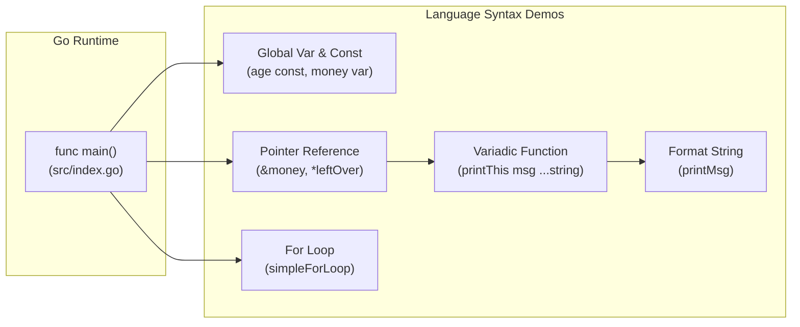

# 🐹 go_practice (Go 언어 기초 문법 실습 예제)

Go (Golang) 언어의 기본 문법, 변수 및 상수 선언, 포인터 연산, 가변 인자 함수(Variadic function) 및 반복문을 실습하는 예제 모듈입니다.

---

## 📐 1. 모듈 내부 아키텍처 (Module Architecture)

---

## 📂 하위 README 링크
- **[src README 바로가기](./src/README.md)**: Go 소스 파일 세부 설명.

