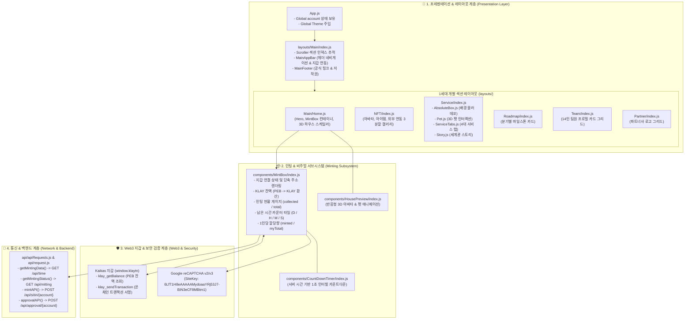
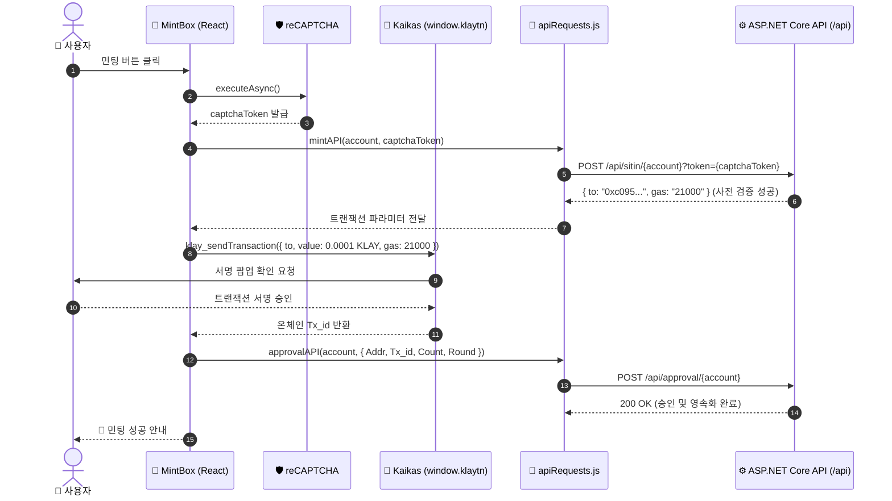

# 🖥️ iSOBOX Frontend v1 ClientApp (1세대 모놀리식 프론트엔드 아키텍처 명세서)

iSOBOX 메타버스 프로젝트의 1세대 오리지널 SPA(Single Page Application) 클라이언트 소스 디렉토리입니다.  
React 17 및 Material-UI(MUI v5)를 기반으로 구축되었으며, 단일 페이지 스크롤 레이아웃 위에 Kaikas 지갑 연동, 3-Phase 온체인 민팅, reCAPTCHA 봇 방지, 3D 하우스/펫 반응형 뷰어를 통합한 초기 아키텍처 명세서입니다.

---

## 📐 1. ClientApp 프론트엔드 전체 아키텍처 맵 (Frontend Architecture)



---

## 📂 2. 디렉토리 구조 및 핵심 모듈 명세

```
isobox frontend v1/ClientApp/
├── public/                     # 정적 웹 자원 및 HTML 템플릿
└── src/
    ├── api/                    # REST API 통신 클라이언트 (Axios)
    ├── assets/                 # 1세대 3D 하우스, 펫 WebP/GIF 애니메이션, 팀원 사진
    ├── components/             # 핵심 UI 컴포넌트
    │   ├── ContactSection/     # 제휴 문의 패널
    │   ├── CountDownTimer/     # 오픈 카운트다운 타이머
    │   ├── HousePreview/       # 반응형 3D 하우스 & 아바타 프리뷰
    │   ├── MainAppBar/         # 헤더 네비게이션 & 지갑 연동 바
    │   ├── MainDrawer/         # 모바일 햄버거 드로어
    │   ├── MainFooter/         # 푸터 저작권 및 링크
    │   └── MintBox/            # Web3 트랜잭션 민팅 카드
    ├── icons/                  # Arrow, Hamburger, Logo SVG 아이콘
    ├── layouts/                # 1세대 모놀리식 페이지 레이아웃
    │   ├── Main/               # 메인 원페이지 쉘 (index.js, Home.js)
    │   ├── NFT/                # NFT 컬렉션 쇼케이스
    │   ├── Partner/            # 파트너사 로고
    │   ├── Roadmap/            # 로드맵 타임라인
    │   ├── Service/            # 서비스 종합 섹션 (Pet, ServiceTabs, Story)
    │   └── Team/               # 14인 팀 프로필 그리드
    ├── res/                    # 리소스, 테마 및 유틸리티
    │   ├── scroller.js         # 스크롤 앵커 추적 엔진
    │   ├── strings.js          # 기본 문자열 딕셔너리
    │   ├── theme.js            # MUI 테마 정의
    │   ├── values.js           # 섹션 및 콘텐츠 데이터 매니페스트
    │   └── windowSize.js       # 윈도우 크기 감지 훅
    ├── App.js                  # 메인 앱 진입점
    └── index.js                # React DOM 렌더링 엔트리포인트
```

---

## ⚡ 3. 3-Phase 민팅 트랜잭션 흐름도



---

## 🚀 4. 빌드 및 로컬 실행 가이드

```bash
# 1. 의존성 패키지 설치
npm install --legacy-peer-deps

# 2. 로컬 개발 서버 기동
npm start

# 3. 상용 프로덕션 빌드 생성
npm run build
```