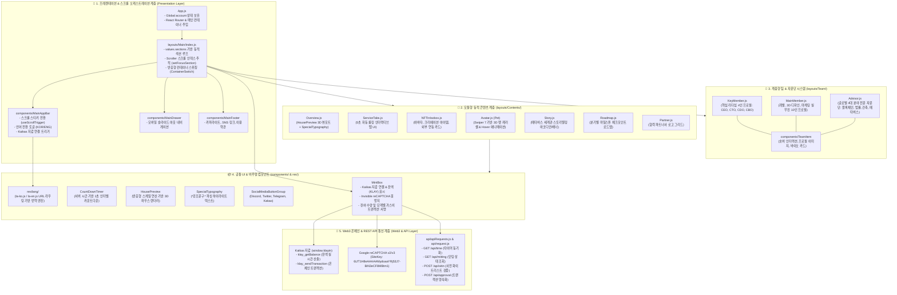

# 🌐 iSOBOX Frontend v2 ClientApp (2세대 모듈화 프론트엔드 아키텍처 명세서)

iSOBOX 메타버스 생태계의 차세대(v2) 웹 포털 SPA(Single Page Application) 클라이언트 소스 디렉토리입니다.  
v1의 모놀리식 레이아웃 구조를 탈피하여 **`values.js` 주도형 동적 섹션 렌더링 파이프라인**, **모듈형 콘텐츠 레이어 (`Contents/`)**, **3계층 팀 & 글로벌 어드바이저 시스템 (`Team/`)**, **URL 기반 실시간 다국어 번역 엔진 (`res/lang/`)**, **Web3(Kaikas) 민팅 & Invisible reCAPTCHA 보안 서브시스템**이 전면 리팩터링되었습니다.

---

## 📐 1. ClientApp 프론트엔드 전체 아키텍처 맵 (Frontend Architecture)

본 어플리케이션은 **프레젠테이션 & 스크롤 오케스트레이션 계층**, **동적 콘텐츠 모듈 계층**, **계층형 팀 & 자문단 계층**, **독립 UI 컴포넌트 & 다국어(i18n) 계층**, **Web3 & 백엔드 통신 계층**의 5개 레이어로 유기적으로 결합되어 있습니다.



---

## 🔄 2. ClientApp 렌더링 파이프라인 & 인터랙션 라이프사이클

`values.sections` 매니페스트로부터 섹션을 동적으로 조립하고, 스크롤 위치 및 다국어 상태를 동기화하는 라이프사이클 흐름입니다.

```mermaid
flowchart TD
    INIT([🌐 앱 최초 마운트: App.js]) --> DETECT_LANG[res/strings.js: URL pathname 검사\n- / 또는 /ko ➔ la-ko.js 로드\n- /en ➔ la-en.js 로드]
    DETECT_LANG --> LOAD_SECTIONS[values.js 섹션 매니페스트 취득\n총 7개 핵심 인터랙티브 섹션 구성]
    
    LOAD_SECTIONS --> RENDER_MAIN[layouts/Main/index.js 렌더링\nScroller 컴포넌트로 뷰포트 오케스트레이션]
    
    subgraph ScrollPipeline ["스크롤 감지 & 동적 스타일 파이프라인"]
        RENDER_MAIN --> SCROLL_EVT[휠/터치 스크롤 이벤트 감지]
        SCROLL_EVT --> SCROLLER_EVAL{현재 뷰포트 Y좌표 계산}
        SCROLLER_EVAL --> UPDATE_SECTION[setFocusSection 인덱스 갱신]
        UPDATE_SECTION --> SYNC_APPBAR[MainAppBar 네비게이션 버튼 하이라이트 동기화]
        SCROLL_EVT --> TRIGGER_STICKY{스크롤 >= 200px ?}
        TRIGGER_STICKY -->|Yes| STICKY_ON[MainAppBar 불투명 흰색 & 보더 활성화]
        TRIGGER_STICKY -->|No| STICKY_OFF[MainAppBar 반투명 블러 모드 유지]
    end

    subgraph ServiceTabsLoop ["ServiceTabs 5초 자동 회전 서브루틴"]
        TAB_MOUNT[ServiceTabs 마운트] --> TAB_TIMER[5초 간격 setInterval 실행]
        TAB_TIMER --> NEXT_TAB[values.serviceContents 인덱스 순환: 0->1->2->3->0]
        NEXT_TAB --> SWITCH_VISUAL[해당 탭의 타이틀, 설명 및 고해상도 이미지 표시]
    end

    subgraph Web3Pipeline ["Web3 지갑 연결 및 민팅 라이프사이클"]
        CLICK_WALLET[사용자 지갑 연결 버튼 클릭] --> CHECK_KAIKAS{window.klaytn 존재 여부}
        CHECK_KAIKAS -->|미설치| GUIDE_STORE[Chrome 웹스토어 Kaikas 설치 링크 안내]
        CHECK_KAIKAS -->|설치됨| REQ_ACCOUNT[klaytn.enable() 계정 승인 요청]
        REQ_ACCOUNT --> FETCH_BAL[klay_getBalance: PEB / 10^18 -> KLAY 잔액 상태 주입]
        FETCH_BAL --> READY_MINT[MintBox 활성화]
    end
```

---

## 📂 3. 디렉토리 구조 및 핵심 모듈 세부 명세

```
isobox frontend v2/ClientApp/
├── public/                     # 정적 웹 자원 및 파비콘
└── src/
    ├── api/                    # 백엔드 REST API 통신 클라이언트
    │   ├── apiRequests.js      # 민팅 시간, 상태, 승인 API 메서드
    │   └── request.js          # Axios 인스턴스 및 인터셉터
    ├── assets/                 # 3D 그래픽, 팀원 14인 프로필, 자문단 4인, 배경 자원
    ├── components/             # 재사용 가능한 원자/분자 단위 독립 컴포넌트
    │   ├── ContactSection/     # 제휴 및 문의 섹션
    │   ├── CountDownTimer/     # 오픈 D-Day 타이머 및 티켓 수량 카드
    │   ├── HousePreview/       # 반응형 3D 아바타 & 하우스 뷰어
    │   ├── MainAppBar/         # 상단 반응형 GNB (다국어/지갑연동/스티키)
    │   ├── MainDrawer/         # 모바일 슬라이드 드로어 네비게이션
    │   ├── MainFooter/         # 푸터 저작권 및 패밀리 링크
    │   ├── MintBox/            # Web3 트랜잭션 & reCAPTCHA 민팅 패널
    │   ├── SocialMediaButtonGroup/ # 공식 SNS 채널 링크 버튼 모음
    │   ├── SpecialTypography/  # 별표(*) 마크다운 파싱 텍스트 하이라이터
    │   └── TeamItem/           # 팀원/어드바이저 프로필 인터랙티브 카드
    ├── icons/                  # SVG 기반 벡터 아이콘 (Logo, Hamburger, SNS 등)
    ├── layouts/                # 페이지 및 섹션 레이아웃
    │   ├── Contents/           # 2세대 핵심 콘텐츠 서브 모듈 (7종)
    │   ├── Main/               # 원페이지 스크롤 메인 쉘 및 Hero 섹션
    │   └── Team/               # 3단계 계층형 팀 & 자문단 섹션
    ├── res/                    # 테마, 다국어 리소스, 전역 설정 매니페스트
    │   ├── lang/               # la-ko.js, la-en.js 다국어 딕셔너리
    │   ├── scroller.js         # 부드러운 원페이지 스크롤 엔진
    │   ├── strings.js          # 활성 언어 감지 및 동적 번역 매퍼
    │   ├── theme.js            # MUI v5 글로벌 테마 정의
    │   ├── values.js           # 전체 웹사이트 콘텐츠 & 섹션 중앙 레지스트리
    │   └── windowSize.js       # 반응형 윈도우 뷰포트 감지 커스텀 훅
    ├── App.js                  # 루트 진입 컴포넌트
    └── index.js                # React DOM 렌더링 엔트리포인트
```

---

## 🧩 4. 세부 모듈 구현 상세 명세 (Module Specifications)

### 4.1 모듈형 콘텐츠 계층 (`src/layouts/Contents/`)

v2 리팩터링의 핵심으로, 기존의 거대한 모놀리식 페이지를 7개의 독립 모듈로 완전히 분리하였습니다.

| 파일명 | 주요 역할 및 특징 | 핵심 렌더링 요소 및 연동 리소스 |
| :--- | :--- | :--- |
| **`Overview.js`** | 메타버스 세계관 개요 및 3D 하우스 소개 | `HousePreview` 컴포넌트와 `SpecialTypography`를 좌우(데스크톱) 또는 상하(모바일)로 분할 배치. |
| **`ServiceTabs.js`** | iSOBOX 4대 핵심 서비스(커뮤니티, 창작, 하우징, 트레이딩) 탭 | 5초 간격 자동 롤링 인터벌 타이머 내장. 840px 브레이크포인트에 따라 수평/수직 레이아웃 자동 변환. |
| **`NFTInIsobox.js`** | 생태계 내 NFT 활용처 소개 | 아바타(Avatar), 제작 아이템(Creation Item), 외부 서비스(External Service) 3분할 카드 그리드. |
| **`Avatar.js (Pet)`** | 3D 펫 & 아바타 캐릭터 인터랙션 | `Swiper 7` 그리드 모듈 연동. 마우스 Hover 및 모바일 슬라이드 시 전면/후면 3D WebP 그래픽의 실시간 투명도/스케일 트랜지션. |
| **`Story.js`** | 메타버스 세계관 및 배경 스토리 전달 | `strings.story_title`, `strings.story_content` 연동 및 배경 그래픽 조합. |
| **`Roadmap.js`** | 분기별 프로젝트 추진 마일스톤 | Phase별 달성 현황(`CheckRounded` 완료 아이콘 vs `MoreHoriz` 진행 예정 아이콘) 시각화. |
| **`Partner.js`** | 생태계 파트너사 및 투자사 쇼케이스 | 전략적 제휴사 로고 그리드 배치. |

---

### 4.2 계층형 팀 & 글로벌 자문단 시스템 (`src/layouts/Team/`)

조직 구조를 3개의 명확한 위계로 구조화하여 투명성과 전문성을 극대화했습니다.

| 컴포넌트 | 대상 구성원 | 주요 역할 및 프로필 정보 |
| :--- | :--- | :--- |
| **`KeyMember.js`** | 4인 핵심 경영진 | **Jimmy** (CEO), **Jay** (CTO), **Eddy** (CDO), **June** (CBO)<br>프로젝트 비전 수립, 블록체인 코어 기술 개발, 비주얼 아트 총괄. |
| **`MainMember.js`** | 10인 실무 개발/디자인 팀 | **Charles, Eggy, Harry, Eric, Jinger, Justin, Mini, Mia, Rose, Wilson**<br>풀스택 웹 개발, 스마트 컨트랙트, 3D 모델링, UX/UI, 커뮤니티 운영. |
| **`Advisor.js`** | 4인 글로벌 전문 자문단 | **Advisor 1** (Blockchain & DeFi 전략)<br>**Advisor 2** (Legal & 글로벌 규제 준수)<br>**Advisor 3** (Architecture & 가상 공간 설계)<br>**Advisor 4** (Metaverse 플랫폼 연동) |

---

### 4.3 핵심 UI 컴포넌트 명세 (`src/components/`)

#### 📦 `MintBox/index.js`
- **지갑 주소 축약 및 잔액 조회**: `klaytn.sendAsync({ method: 'klay_getBalance' })`를 호출하여 PEB을 KLAY로 자동 변환.
- **3-Phase 민팅 트랜잭션**:
  1. `ReCAPTCHA v2/v3`를 백그라운드에서 `executeAsync()`로 실행하여 봇 방지 토큰 획득
  2. `mintAPI`를 호출하여 백엔드 화이트리스트 및 참여 자격 검증
  3. `klaytn.sendAsync({ method: 'klay_sendTransaction' })`으로 지갑 서명 팝업 트리거
  4. 서명 해시를 수령 후 `approvalAPI`로 백엔드 영속화 및 수량 갱신 요청

#### ⏱️ `CountDownTimer/index.js`
- **동적 카운트다운**: 백엔드 `/api/time`에서 수신한 `startdate`와 `nowdate`를 기준으로 남은 Day, Hour, Min, Sec를 실시간(1초 단위) 감산 계산.
- **상태 카드**: 화이트리스트 여부, 일반 유저 여부, 민팅 가능 총 수량(13,500개) 타일 UI 렌더링.

#### 🔤 `SpecialTypography/index.js`
- **커스텀 마크다운 하이라이터**: 전달받은 텍스트 내에서 `*텍스트*` 패턴을 정규표현식으로 실시간 분할 파싱하여, 별표로 감싸진 키워드에만 테마 강조 스타일(`subStyle`)을 자동 적용하는 고유 텍스트 컴포넌트.

#### 🏠 `HousePreview/index.js`
- **반응형 3D 하우스 뷰어**: 부모 컨테이너의 너비에 맞추어 스케일 계수를 동적으로 계산하여, 모바일 및 고해상도 데스크톱 뷰포트에서 왜곡 없는 3D 일러스트레이션을 렌더링.

---

### 4.4 다국어 번역 시스템 (`src/res/lang/` & `src/res/strings.js`)

- **지원 언어**: 한국어(`la-ko.js`, 기본), 영어(`la-en.js`)
- **라우팅 연동**: URL 경로명(`window.location.pathname`)을 파싱하여 `/en` 접속 시 자동으로 영어 리소스 매핑.
- **원클릭 언어 스위칭**: `switchLanguage(key)` 호출 시 URL 경로를 즉시 전환하여 새로고침 없이 일관된 다국어 뷰 제공.

---

## 🔬 5. 핵심 연산 알고리즘 및 기술 공식

### 5.1 SpecialTypography 텍스트 파싱 알고리즘
```javascript
// SpecialTypography/index.js 내부 동작 원리
const parts = children.split(/(\*[^*]+\*)/g);
return parts.map((part, index) => {
    if (part.startsWith('*') && part.endsWith('*')) {
        return <span key={index} style={subStyle}>{part.slice(1, -1)}</span>;
    }
    return part;
});
```

### 5.2 Klaytn 잔액 PEB ➔ KLAY 변환 공식
$$\text{KLAY} = \frac{\text{result.result (PEB)}}{10^{18}}$$

### 5.3 온체인 고정 트랜잭션 파라미터
- `gas`: `21000`
- `value`: `100000000000000` PEB ($10^{14}$ PEB = $0.0001$ KLAY)
- `sitekey`: `6LfT1H8eAAAAAMydoaaYRj53J7-BiN3eCF8MBtm1`

---

## 🚀 6. 빌드 및 로컬 실행 가이드

```bash
# 1. 의존성 패키지 설치 (React 17 및 MUI v5 피어 의존성 대응)
npm install --legacy-peer-deps

# 2. 로컬 개발 서버 기동 (포트 3000 또는 유휴 포트)
npm start

# 3. 상용 프로덕션 빌드 생성
npm run build
```