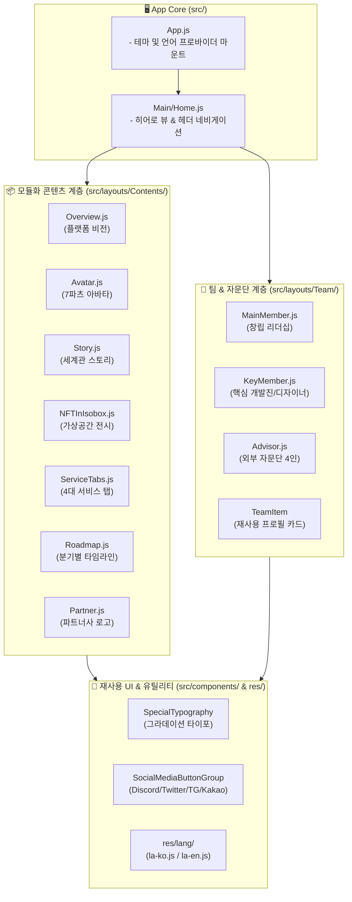

# 🎨 iSOBOX Frontend v2 (차세대 모듈형 프론트엔드 아키텍처 상세 명세서)

iSOBOX 메타버스 플랫폼의 UI/UX 개편 및 글로벌 다국어 지원을 위해 컴포넌트 아키텍처를 전면 모듈화하여 재설계한 **2세대 프론트엔드 프로젝트**입니다. v1의 단일 거대 페이지 구조를 도메인 단위의 독립 서브 모듈(`Contents/`, `Team/`, `res/lang/`)로 리팩터링하였습니다.

---

## 📐 1. 컴포넌트 계층 & 레이아웃 아키텍처 (Component Architecture Map)



---

## 📄 2. 세부 화면 및 콘텐츠 모듈 명세 (Contents Specification)

| 컴포넌트 파일 | 역할 및 렌더링 콘텐츠 | 주요 애셋 / UI 특징 |
| :--- | :--- | :--- |
| **`Contents/Overview.js`** | iSOBOX 메타버스 플랫폼 비전 및 헤더 히어로 요약 | 메인 로고 및 비주얼 배너 |
| **`Contents/Avatar.js`** | 7개 파츠(몸체, 얼굴, 헤어, 의상, 악세서리 등) 조합 NFT 아바타 소개 | 반응형 아바타 카드 |
| **`Contents/Story.js`** | 아이소팩토리 세계관 스토리라인 텍스트 및 일러스트 슬라이드 | 캐러셀 슬라이더 연동 |
| **`Contents/NFTInIsobox.js`** | 가상 메타버스 공간 내 NFT 전시장 및 3D 쇼룸 소개 | 3D 하우스 그래픽 쇼케이스 |
| **`Contents/ServiceTabs.js`** | **Trade, Creation, Housing, Community** 4대 메타버스 서비스 탭 | 신규 테마 일러스트(`housing.png`, `trade.png` 등) |
| **`Contents/Roadmap.js`** | 분기별 로드맵(Avatar NFT ➔ Marketplace ➔ Custom Tool) | 타임라인 형태 시각화 |
| **`Contents/Partner.js`** | 공식 블록체인 파트너사 및 투자 기관 로고 그리드 | 타일 그리드 배치 |

---

## 👥 3. 팀 & 어드바이저 구성 모델 (Team Specification)

* **`MainMember.js`**: Founder & CEO, Project Director 등 핵심 의사결정권자
* **`KeyMember.js`**: 블록체인 엔지니어, 프론트엔드 개발자, 3D 애니메이터, UI/UX 디자이너 (총 9인)
* **`Advisor.js`**: 메타버스/블록체인 산업 전문가 및 기술 자문단 (총 4인, `advisor1.png ~ advisor4.png`)
* **`TeamItem/index.js`**: 아바타 썸네일, 직무(Role), 이름, 좌우명 텍스트를 정렬하는 표준 카드 컴포넌트

---

## 🌐 4. 다국어(i18n) 시스템 구조

* **`src/res/lang/la-ko.js`**: 한국어 전용 메뉴 텍스트, 세계관 소개, 버튼 레이블
* **`src/res/lang/la-en.js`**: 글로벌 런칭용 영문 번역 텍스트
* **동적 전환**: 상단 네비게이션 또는 설정에서 로케일 키를 전환하여 실시간 리렌더링

---

## 🛠️ 5. 개발 환경 실행 가이드

```bash
cd ClientApp
npm install --legacy-peer-deps
npm start
```
* 로컬 접속 주소: `http://localhost:3000` (또는 `PORT=3002`)
