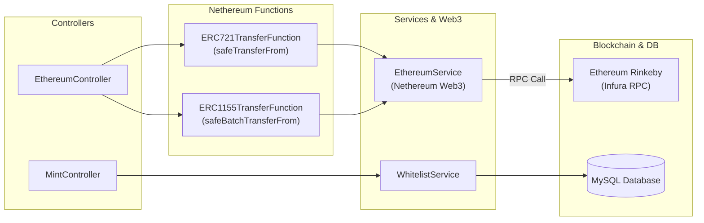

# 🧪 Minting Test (NFT 민팅 & 스마트 컨트랙트 테스트 API 명세서)

이더리움 및 EVM 계열 스마트 컨트랙트(ERC-721 및 ERC-1155)의 민팅, 전송(Transfer) 및 가스비 한도 검증을 위한 테스트용 백엔드 API 서비스입니다.

---

## 📐 1. 모듈 내부 아키텍처 (Module Architecture)

---

## 🛠️ 주요 테스트 기능

1. Nethereum을 이용한 ERC-721 `safeTransferFrom` 트랜잭션 전송 테스트
2. Nethereum을 이용한 ERC-1155 `safeBatchTransferFrom` 배치 토큰 전송 테스트
3. 가스비(Gas Limit, Gas Price) 및 블록체인 영수증(Transaction Receipt) 반환 검증

---

## 📂 하위 README 링크
- **[MintingTest README 바로가기](./MintingTest/README.md)**: Nethereum ABI 테스트 함수 및 C# 코드 상세 명세.
