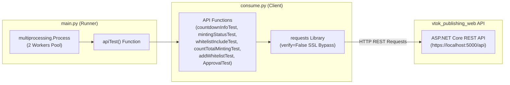

# 🐍 python_rest_api_practice (Python 기반 vtok_publishing_web API 연동 테스트 명세서)

Python `requests` 및 `multiprocessing` 라이브러리를 이용하여 `vtok_publishing_web` 백엔드 REST API의 엔드포인트를 클라이언트 관점에서 통합 테스트하고, 멀티프로세싱 병렬 성능을 검증하는 파이썬 테스트 스크립트 모듈입니다.

---

## 📐 1. 모듈 내부 아키텍처 (Module Architecture)



---

## 🛠️ 주요 소스 스크립트 명세 (Script Technical Spec)

### 1. `consume.py` (vtok_publishing_web API 연동 클라이언트)
- **Base URL**: `BASE_URL = "https://localhost:5000/api"` (`verify=False` SSL 자체서명인증서 바이패스)
- **테스트 함수 목록**:
  - `countdownInfoTest()`: `GET /api/time` 호출 ➔ 민팅 라운드 카운트다운 응답 상태코드 수신.
  - `mintingStatusTest()`: `GET /api/mitting` 호출 ➔ 민팅 일정 및 진행 상태 수신.
  - `whitelistIncludeTest(address)`: `GET /api/addr/{id}` ➔ 화이트리스트 주소 유효성 테스트.
  - `countTotalMintingTest(minting_number)`: `GET /api/count/{round}` ➔ 라운드 수량 카운터 테스트.
  - `addWhitelistTest(address)`: `POST /api/sitin/{id}` ➔ 대기열 사전 등록 테스트.
  - `ApprovalTest(address)`: `POST /api/approval/{id}` ➔ 민팅 승인 요청 테스트.

### 2. `main.py` (병렬 실행 및 멀티프로세싱 테스트)
- **`NUM_PROC = 2`**: 2개의 멀티프로세스(`multiprocessing.Process`)를 생성하여 난수 생성 및 부하 테스트 실행.
- **`apiTest()`**: `consume.py` 내의 연동 함수를 동기식으로 호출하여 API 정상 동작 확인.

---

## 🚀 실행 방법 (Execution Guide)

```bash
# 1. 파이썬 의존성 패키지 설치
pip install requests

# 2. API 연동 테스트 스크립트 실행
python main.py
```
