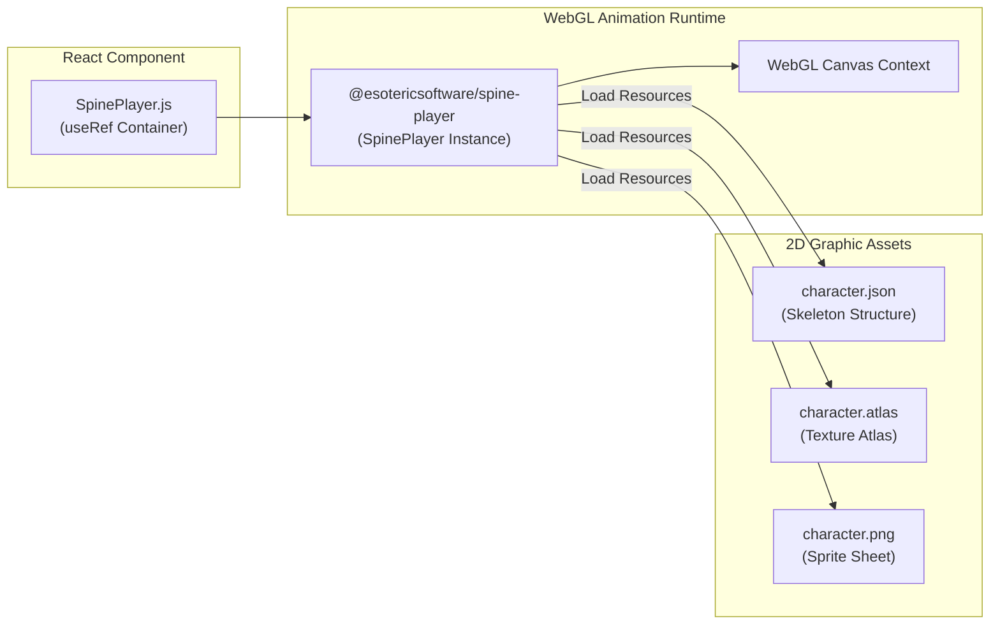

# 🎮 Spine Player Test (Spine 2D 캐릭터 플레이어 웹 테스트 명세서)

Esoteric Software의 2D 캐릭터 스파인 애니메이션 자원(.json, .atlas, .png)을 WebGL Canvas 상에서 인터랙티브하게 렌더링하고 애니메이션 스킨/모션을 테스트하는 React 웹 어플리케이션입니다.

---

## 📐 1. 모듈 내부 아키텍처 (Module Architecture)

---

## 🛠️ 기술 스택 (Tech Stack)

- **Frontend**: React.js 17+
- **Animation Engine**: `@esotericsoftware/spine-player` (v4.x WebGL Runtime)

---

## 📂 하위 README 링크
- **[src README 바로가기](./src/README.md)**: SpinePlayer 렌더링 코드 및 자원 경로 명세.
