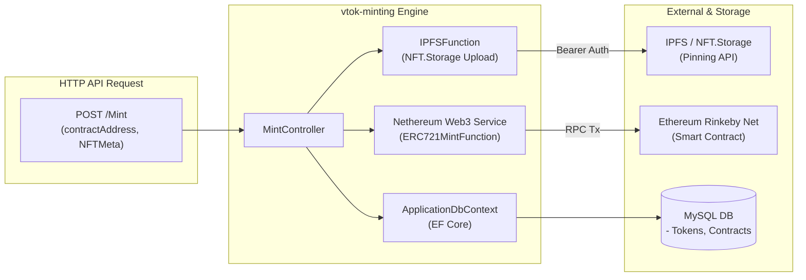
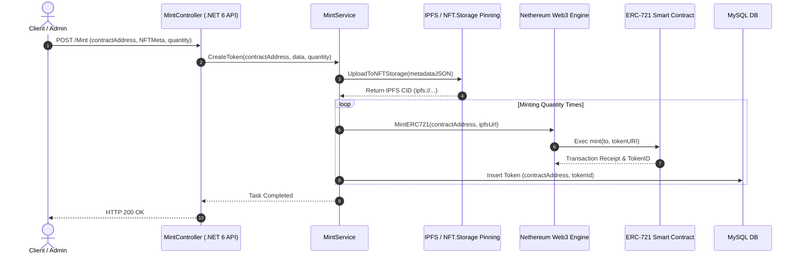

# ⛏️ VTOK Minting Backend (NFT 민팅 Engine 상세 명세서)

VTOK 코어 시스템의 NFT 민팅, IPFS 메타데이터 업로드, 스마트 컨트랙트 트랜잭션 전송 및 화이트리스트 검증을 담당하는 백엔드 엔진 서비스입니다.

---

## 📐 1. 모듈 내부 아키텍처 (Module Architecture)

---

## 🏗️ 1. 민팅 파이프라인 프로세스 (Minting Sequence Detail)

---

## 🔌 2. API 컨트롤러 상세 명세 (Controllers Specification)

### 2.1 `MintController.cs`
- `POST /Mint?contractAddress={contract}&quantity={quantity}`
  - Params: `contractAddress` (string), `quantity` (int, default=1)
  - Body: `NFTMeta` JSON 객체
  - Exceptions:
    - `"Contract Address Not Found"` (HTTP 409 Conflict)
    - `"Minting Started"` (HTTP 400 BadRequest)

### 2.2 `TokenController.cs`
- `GET /Token`: 전체 토큰 배열 반환 (`ActionResult<List<Token>>`)
- `POST /Token?contractAddress={contract}&tokenId={id}`: 토큰 엔티티 추가
- `DELETE /Token?contractAddress={contract}&tokenId={id}`: 토큰 삭제

### 2.3 `WhitelistController.cs`
- `GET /Whitelist`: 화이트리스트 주소 목록 조회
- `POST /Whitelist`: 화이트리스트 수량 지정 등록

---

## 📂 하위 README 링크
- **[MainApplication README 바로가기](./MainApplication/README.md)**: Web3 및 IPFS 유틸리티 함수 상세 명세.
