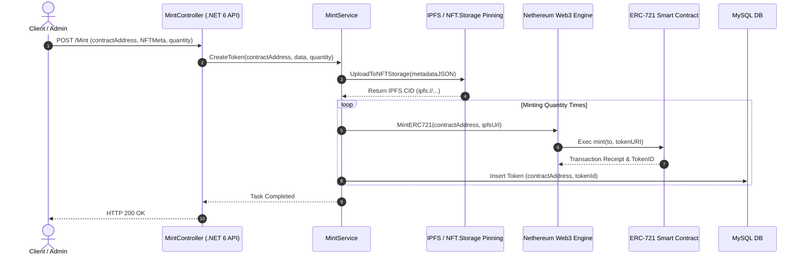

# ⛏️ VTOK Minting Backend (NFT 민팅 & 메타데이터 API)

VTOK 코어 시스템의 NFT 민팅, IPFS 메타데이터 업로드, 스마트 컨트랙트 트랜잭션 전송 및 화이트리스트 검증을 담당하는 백엔드 엔진 서비스입니다.

---

## 🏗️ NFT 민팅 처리 아키텍처 (Minting Pipeline)



---

## 🛠️ 기술 스택 (Tech Stack)

- **Framework**: C# (.NET 6.0 / ASP.NET Core Web API)
- **Web3 Engine**: Nethereum.Web3 (ERC-721 Web3 RPC Client)
- **Decentralized Storage**: IPFS (InterPlanetary File System API / `NFT.Storage` Client)
- **Database**: Entity Framework Core 6, MySQL DB (`ApplicationDbContext`)

---

## 📂 디렉토리 구조 (Directory Structure)

```text
vtok-minting/
└── MainApplication/       # 백엔드 코어 Web API 프로젝트 디렉토리 (상세설명은 하위 README)
    ├── Context/           # EF Core Database Context (ApplicationDbContext)
    ├── Controllers/       # ContractController, MintController, TokenController, WhitelistController
    ├── Dtos/              # IPFSData, NFTMeta Data Transfer Objects
    ├── Migrations/        # EF Core DB 마이그레이션 이력
    ├── Models/            # Contract, KeyValue, Token, Whitelist DB 엔티티
    ├── Repositories/      # ContractRepository, KeyValueRepository, TokenRepository, WhitelistRepository
    ├── Services/          # CommonService, ContractService, ControlService, MintService, TokenService, WhitelistService
    └── Utils/             # Web3Functions (Nethereum RPC), IPFSFunction (Pinning), Contract Function DTOs
```

- **[MainApplication README 바로가기](./MainApplication/README.md)**: 소스 코드 레이어별 상세 사양 안내.
