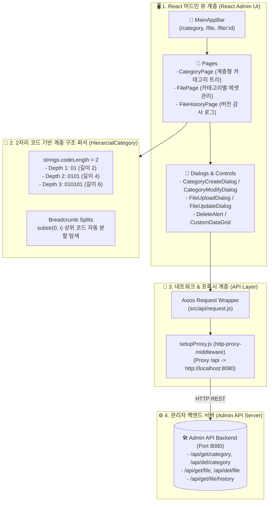

# 🖥️ VTOK Admin Frontend (VTOK 관리자 백오피스 상세 지침서)

VTOK 플랫폼 운영자를 위한 전용 React 백오피스 어드민 웹 애플리케이션의 세부 명세서입니다.

---

## 📐 1. 모듈 내부 아키텍처 (Module Architecture)

---

## 🏗️ 2. 모듈별 소스 파일 단위 명세 (File-by-File Technical Spec)

### 2.1 `src/api/request.js` (Axios API 통신 인스턴스)
- **Base Config**: `baseURL` 지정 및 `Content-Type: application/json`.
- **`apiRequest(config)`**: Axios 요청 래퍼 함수. 성공 시 `response.data` 반환, 실패 시 에러 콘솔 출력 및 예외 던짐.

---

### 2.2 `src/page/CategoryPage.js` (계층형 카테고리 대시보드)
- **`columns` 정의**:
  1. `{ field: 'Line', headerName: '코드', type: 'number', hide: true }`
  2. `{ field: 'Name', headerName: '이름', width: 300 }`
  3. `{ field: 'Code', headerName: '상위코드', type: 'number', hide: true }`
  4. `{ field: 'actions', type: 'actions', width: 150 }`:
     - `<AccountTreeRounded />` ➔ `setCreateOpen(true)`, `setParent(r.id)` (자식 카테고리 추가)
     - `<EditRounded />` ➔ `setEdit(r.row)` (카테고리 정보 수정 모달)
     - `<DeleteRounded />` ➔ `setAlert(r.id)` (카테고리 삭제 모달)

- **삭제 핸들러 (`handleDelete`)**:
  - `POST /api/del/category` 호출.
  - Query Params: `line: alert` (삭제 대상), `reline: move` (이관 대상 카테고리 주소).
  - 성공 후 `getData(true)`를 호출하여 전체 카테고리 트리 재조회.

---

### 2.3 `src/page/FilePage.js` (파일 라이브러리 대시보드)
- 특정 카테고리에 속한 파일 목록 조회 (`GET /api/get/file`).
- 파일 추가 (`FileUploadDialog.js`), 버전 업데이트 (`FileUpdateDialog.js`), 삭제 (`POST /api/del/file`).

---

### 2.4 `src/page/FileHistoryPage.js` (Audit 이력 데이터그리드)
- 전체 파일 변경/작업 로그 목록 조회 (`GET /api/get/file/history`).
- 작업자, 작업 유형(업로드, 수정, 삭제), 타임스탬프 및 버전 변경 내역 모니터링.

---

## 📄 하위 README 링크
- **[src README 바로가기](./src/README.md)**: 컴포넌트 Props 및 트리 파싱 알고리즘 안내.
