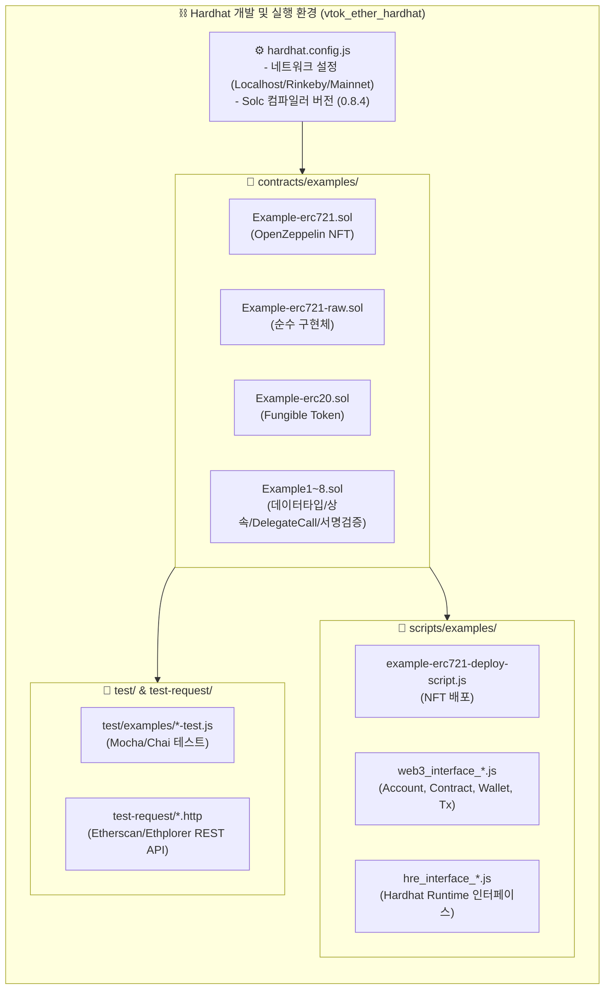

# ⛓️ VTOK Ether Hardhat (Solidity & Hardhat 스마트 컨트랙트 개발/테스트 환경)

이더리움 및 EVM 호환 블록체인 네트워크를 위한 **Hardhat 기반 Solidity 스마트 컨트랙트 개발, 배포, 단위 테스트 및 Web3 상호작용 스크립트 환경**입니다. OpenZeppelin 표준 기반의 ERC-721/ERC-20 구현부터 저수준 Raw 컨트랙트, 가스 최적화, DelegateCall, 전자서명 검증(`ecrecover`)에 이르는 스마트 컨트랙트 연구 및 개발을 담당합니다.

---

## 📐 1. 아키텍처 및 디렉토리 구조



---

## 📂 2. 주요 파일 및 컴포넌트 명세

| 경로 | 유형 | 설명 |
| :--- | :---: | :--- |
| `hardhat.config.js` | 설정 | Hardhat 런타임 환경 설정, Solidity 컴파일러(0.8.4) 및 테스트 네트워크 구성 |
| `contracts/examples/Example-erc721.sol` | 컨트랙트 | OpenZeppelin 표준 상속 기반 ERC-721 NFT 민팅 및 메타데이터 컨트랙트 |
| `contracts/examples/Example-erc721-raw.sol` | 컨트랙트 | 외부 라이브러리 없이 표준 인터페이스 및 전송/소유권 로직을 직접 구현한 순수 ERC-721 |
| `contracts/examples/Example-erc20.sol` | 컨트랙트 | ERC-20 표준 기반 대체 가능 토큰 컨트랙트 |
| `contracts/examples/Example5-fallback.sol` | 컨트랙트 | 이더 수신 핸들러(`receive()`, `fallback()`) 및 `payable` 전송 패턴 실습 |
| `contracts/examples/Example5.sol` | 컨트랙트 | `delegatecall` 및 컨트랙트 간 함수 호출(Callee/Caller) 패턴 |
| `contracts/examples/Example8.sol` | 컨트랙트 | Keccak256 해시 생성, 오버플로우 검증 및 오프체인 서명 검증(`VerifySignature`) |
| `scripts/examples/example-erc721-deploy-script.js` | 스크립트 | Hardhat Ethers를 활용한 NFT 스마트 컨트랙트 자동 배포 스크립트 |
| `scripts/examples/web3_interface_*.js` | 스크립트 | Web3.js 모듈(지갑 생성, 트랜잭션 서명, 프로바이더 연결, 컨트랙트 호출) 실무 코드 |
| `test/examples/*-test.js` | 테스트 | Chai Assertion 라이브러리를 활용한 스마트 컨트랙트 단위 테스트 |

---

## 🛠️ 3. 실행 및 테스트 방법

### 1) 의존성 패키지 설치
```bash
npm install
```

### 2) 컨트랙트 컴파일
```bash
npx hardhat compile
```

### 3) 로컬 이더리움 노드 실행
```bash
npx hardhat node
```

### 4) 단위 테스트 실행
```bash
npx hardhat test
```

### 5) 배포 스크립트 실행
```bash
npx hardhat run scripts/examples/example-erc721-deploy-script.js --network localhost
```
