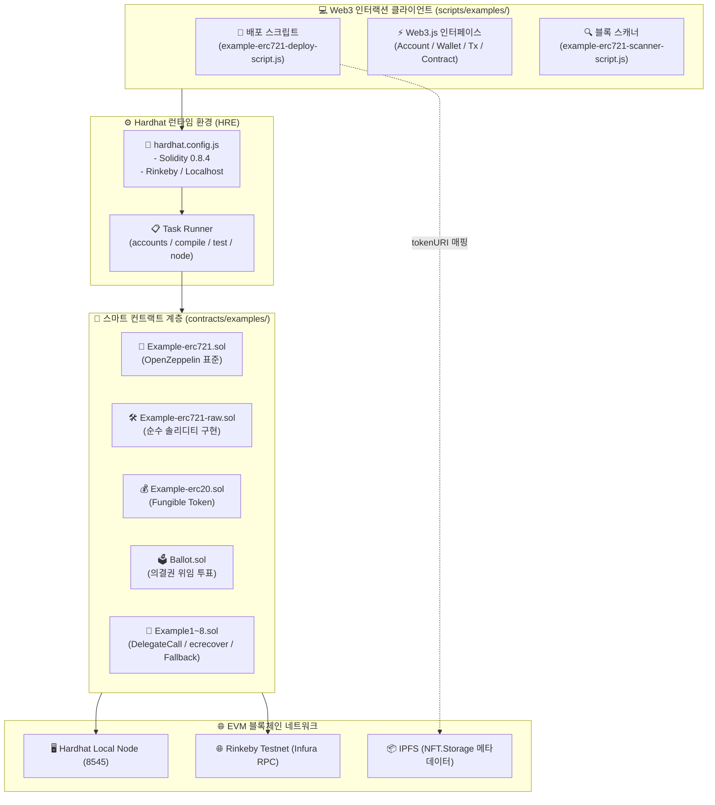
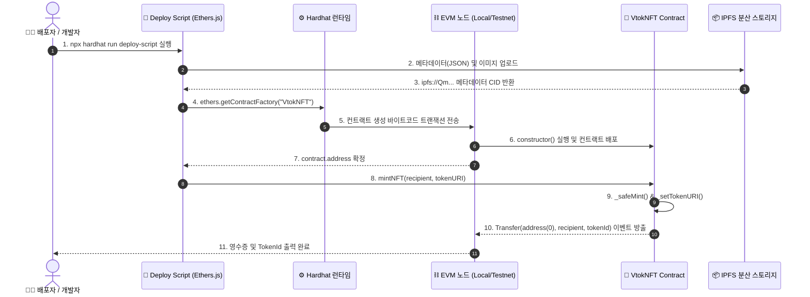
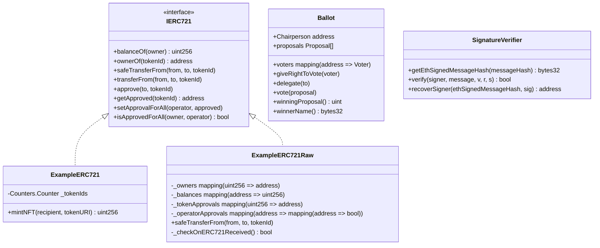

# ⛓️ VTOK Ether Hardhat (스마트 컨트랙트 & Web3 개발 환경 상세 명세서)

이더리움 메인넷 및 EVM 호환 블록체인을 위한 **Hardhat 기반 Solidity 스마트 컨트랙트 개발, 배포, 테스팅 및 Web3.js 연동 프레임워크**입니다. OpenZeppelin 표준 상속 컨트랙트부터 순수 저수준 솔리디티 구현체, 대리 호출(`delegatecall`), 오프체인 서명 검증(`ecrecover`)에 이르는 스마트 컨트랙트 코어 엔진을 담당합니다.

---

## 📐 1. 모듈 전체 아키텍처 및 데이터 흐름 (Architecture Map)



---

## 🔄 2. NFT 배포 및 민팅 시퀀스 (NFT Deployment & Mint Pipeline)



---

## 📜 3. 스마트 컨트랙트 클래스 다이어그램 & 구조도



---

## 📄 4. 솔리디티 컨트랙트 상세 함수 명세 (Contracts API Reference)

| 컨트랙트 파일명 | 함수명 (Method Signature) | 가시성 / 변경성 | 반환값 | 상세 기능 및 비즈니스 로직 |
| :--- | :--- | :---: | :---: | :--- |
| **`Example-erc721.sol`** | `mintNFT(address recipient, string memory tokenURI)` | `public` | `uint256` | TokenId 1 증가 ➔ 수신자에게 발행 ➔ IPFS 메타데이터 바인딩 |
| **`Example-erc721-raw.sol`** | `safeTransferFrom(address from, address to, uint256 tokenId)` | `public` | `void` | `onERC721Received` 매직 넘버(0x150b7a02) 수신 검증 후 소유권 안전 이전 |
| 〃 | `approve(address to, uint256 tokenId)` | `public` | `void` | 특정 토큰에 대한 1회성 전송 권한 위임 |
| 〃 | `setApprovalForAll(address operator, bool approved)` | `public` | `void` | 지갑 보유 전체 토큰에 대한 오퍼레이터(거래소 등) 권한 위임 |
| **`Example-erc20.sol`** | `transfer(address recipient, uint256 amount)` | `public` | `bool` | ERC-20 잔액 차감 및 수신자에게 송금 |
| **`Ballot.sol`** | `giveRightToVote(address voter)` | `public` | `void` | 의장(Chairperson)이 특정 주소에 투표권 가중치(`weight = 1`) 부여 |
| 〃 | `delegate(address to)` | `public` | `void` | 자신의 투표권을 다른 유권자 주소로 위임 (순환 참조 방지 루프 내장) |
| 〃 | `vote(uint proposal)` | `public` | `void` | 특정 제안에 가중치만큼 온체인 투표 집계 |
| **`Example5-fallback.sol`** | `receive() external payable` | `external payable` | `void` | 순수 ETH 송금 트랜잭션 자동 수신 핸들러 |
| 〃 | `fallback() external payable` | `external payable` | `void` | 정의되지 않은 함수 호출 트랩 및 데이터/이더 동시 수신 |
| **`Example5.sol`** | `delegatecall(bytes data)` | `public` | `bool` | 호출자의 스토리지 컨텍스트를 유지한 채 외부 컨트랙트 로직 실행 (프록시 패턴) |
| **`Example8.sol`** | `verify(address signer, string memory message, bytes memory sig)` | `public pure` | `bool` | `ecrecover`를 호출하여 서명 파라미터 `(v, r, s)`로부터 서명자 주소 검증 |

---

## ⚡ 5. Web3 스크립트 명세 (`scripts/examples/`)

| 스크립트 파일명 | 실행 명령어 | 주요 기능 |
| :--- | :--- | :--- |
| **`example-erc721-deploy-script.js`** | `npx hardhat run scripts/examples/example-erc721-deploy-script.js` | 컨트랙트 컴파일 및 로컬/테스트넷 배포 자동화 |
| **`example-erc721-scanner-script.js`** | `node scripts/examples/example-erc721-scanner-script.js` | 블록체인 노드를 폴링하여 `Transfer` 이벤트 실시간 수집 |
| **`web3_interface_account-scirpt.js`** | `node scripts/examples/web3_interface_account-scirpt.js` | Web3 키쌍 생성, 개인키 암호화 및 잔액 확인 |
| **`web3_interface_transaction-scirpt.js`** | `node scripts/examples/web3_interface_transaction-scirpt.js` | 가스 한도 계산, 트랜잭션 수동 서명 및 노드 전송 |
| **`web3_interface_contract-scirpt.js`** | `node scripts/examples/web3_interface_contract-scirpt.js` | ABI 기반 온체인 컨트랙트 함수 원격 실행 (`call` / `send`) |

---

## 🧪 6. 테스팅 및 명령어 가이드

```bash
# 1. 의존성 설치
npm install

# 2. 컨트랙트 컴파일
npx hardhat compile

# 3. 로컬 독립 블록체인 노드 실행 (포트 8545)
npx hardhat node

# 4. 전체 단위 테스트 (Mocha/Chai)
npx hardhat test

# 5. 로컬 네트워크 대상 배포
npx hardhat run scripts/examples/example-erc721-deploy-script.js --network localhost
```
