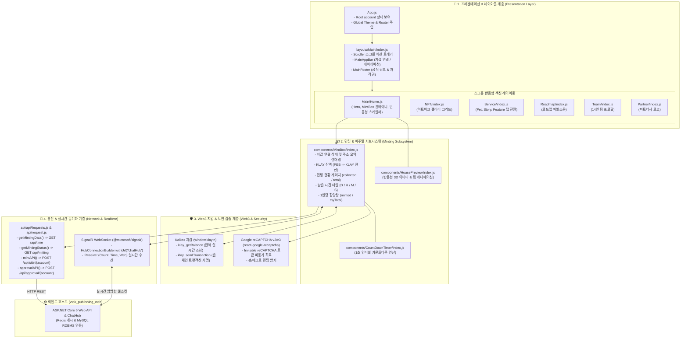
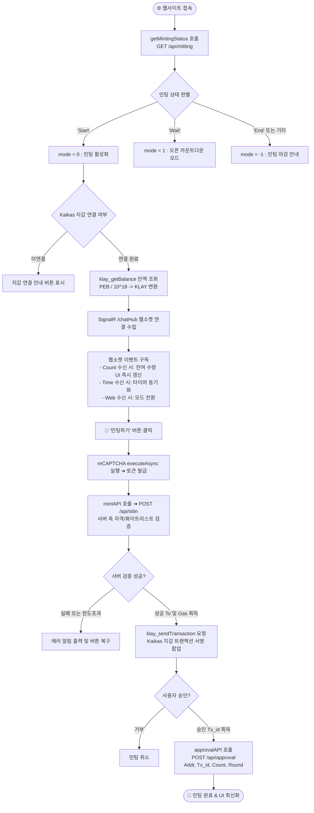
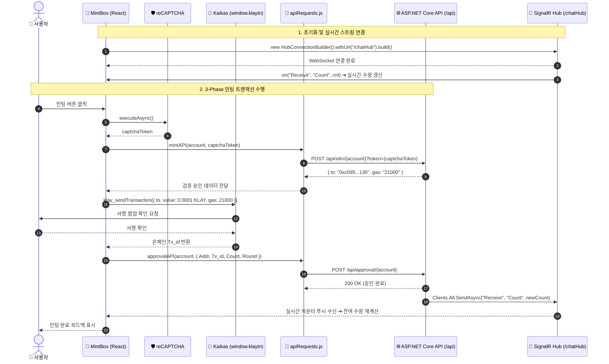

# 📱 VTOK Publishing Web ClientApp (React Frontend 세부 아키텍처 지침서)

VTOK 플랫폼의 메인 브랜딩 웹사이트, Web3 지갑(Kaikas) 연동, reCAPTCHA 봇 방지, 실시간 카운트다운 타이머 및 SignalR 실시간 수량 동기화를 담당하는 React 17 SPA 프론트엔드 어플리케이션의 세부 아키텍처 및 소스 명세서입니다.

---

## 📐 1. ClientApp 프론트엔드 전체 아키텍처 맵 (Frontend Architecture)

본 프론트엔드 어플리케이션은 **프레젠테이션 레이아웃 계층**, **민팅 & 타이머 서브시스템**, **Web3 & 봇 검증 계층**, **REST API & SignalR 웹소켓 실시간 통신 계층**의 4개 레이어로 체계화되어 있습니다.



---

## 🔄 2. ClientApp 내부 상태 & 인터랙션 라이프사이클 (State & Lifecycle)

사용자 접속부터 지갑 연결, 민팅 진행, 실시간 동기화까지 프론트엔드 내부의 상태 변화 흐름입니다.



---

## ⚡ 3. Web3 & SignalR 통신 시퀀스 (Frontend Interaction Sequence)



---

## 📂 4. 파일별 기능 및 인터페이스 세부 명세 (File & Component Breakdown)

### 4.1 API & SignalR 연동 Layer (`src/api/`)
- **`src/api/request.js`**:
  - Axios 인스턴스 생성: `baseURL: ''`, `timeout: 10000`.
  - 응답 인터셉터를 통한 HTTP 401/403/500 에러 처리 및 표준 Promise 반환.
- **`src/api/apiRequests.js`**:
  - **`getMintingData(onSuccess, onError)`**: `GET /api/time` 호출 ➔ 현재 활성화된 라운드 정보 및 남은 시각(`Time` 모델) 수신.
  - **`getMintingStatus(onSuccess, onError)`**: `GET /api/mitting` 호출 ➔ 현재 시스템 민팅 상태(`"Wait"`, `"Start"`, `"End"`) 수신.
  - **`mintAPI(account, recaptchaToken, onSuccess, onError)`**: `POST /api/sitin/${account}?token=${recaptchaToken}` 호출 ➔ 봇 방지 검증, 화이트리스트 검사 및 송금 주소(`to`) 획득.
  - **`approvalAPI(account, body, onSuccess, onError)`**: `POST /api/approval/${account}` 호출 ➔ 온체인 트랜잭션 해시(`Tx_id`), 수량, 라운드 전달 및 승인 확정.

---

### 4.2 UI 컴포넌트 Layer (`src/components/`)

#### 📦 `MintBox/index.js`
- **역할**: Web3 지갑 연동, reCAPTCHA 봇 방지, 잔액 표시, 카운트다운 타이머 렌더링, SignalR 실시간 수량 반영을 총괄하는 핵심 컴포넌트.
- **Kaikas 지갑 연동**:
  ```js
  const getUserBalance = async (address) => {
      await klaytn.sendAsync({method: 'klay_getBalance', params: [address, 'latest']},
          (err, result) => setBalance(result.result / Math.pow(10, 18)));
  }
  ```
- **3-Phase 민팅 핸들러 (`handleMinting`)**:
  1. `recaptchaRef.current.executeAsync()`로 봇 방지 토큰 발급
  2. `mintAPI` 호출하여 서버 사전 검증 수행
  3. `klaytn.sendAsync({ method: 'klay_sendTransaction', params: [transactionParameters] })`로 트랜잭션 서명
  4. `approval(result)`에서 `approvalAPI`를 호출하여 서버 DB 영속화 요청

#### ⏱️ `CountDownTimer/index.js`
- **역할**: 라운드 시작/종료 시각까지 남은 시간을 1초 간격으로 계산 및 시/분/초 2자리 패딩 표시.
- **Props**: `targetTime` (Unix Timestamp MS)

#### 🏠 `HousePreview/index.js`
- **역할**: VTOK 메타버스 하우스, 아바타, 펫 3종의 애니메이션 WebP/GIF 렌더링.
- **반응형 뷰포트 연동**: [`Home.js`](./src/layouts/Main/Home.js)의 윈도우 폭 변경 이벤트에 따라 동적 스케일링(`scale`) 적용.

#### 🧭 `MainAppBar/index.js` & `MainDrawer/index.js`
- **역할**: 상단 헤더 네비게이션 바 및 모바일용 반응형 드로어. 지갑 연결 버튼 및 현재 연결된 지갑 주소 단축 표시(`0x...`).

---

### 4.3 페이지 레이아웃 Layer (`src/layouts/`)
- **`Main/index.js`**: `Scroller`를 활용하여 원페이지 스크롤 뷰 구성 및 섹션 포커스 트래킹.
- **`Main/Home.js`**: 히어로 배너, 브랜드 아이덴티티, 3D 하우스 그래픽 및 민팅 상태(`getMintingStatus`)에 따른 `MintBox` 조건부 렌더링.
- **`NFT/index.js`**: VTOK NFT 아트워크 수집품 그리드 카드 레이아웃.
- **`Service/`**: `ServiceTabs.js`, `Pet.js`, `Story.js`, `AbsoluteBox.js`를 통한 메타버스 세계관 소개.
- **`Roadmap/index.js`**: 분기별 프로젝트 추진 로드맵 카드.
- **`Team/index.js`**: 14인의 핵심 팀원 프로필 카드 레이아웃.
- **`Partner/index.js`**: 협력 파트너사 로고 그리드.

---

### 4.4 리소스 & 반응형 유틸리티 Layer (`src/res/`)
- **`theme.js`**: MUI v5 커스텀 테마 (`primary: #007FFF`, 타이포그래피, 브레이크포인트).
- **`windowSize.js`**: 브라우저 창 크기 실시간 감지 훅 (`useWindowDimensions`).
- **`scroller.js`**: 휠 및 터치 제스처를 감지하여 부드러운 섹션 전환을 제공하는 스크롤 엔진.

---

## 🔬 5. 심층 분석 구현 파라미터 및 상수 명세 (Implementation Constants & Specs)

소스 코드 정밀 분석을 통해 도출된 핵심 파라미터 및 비즈니스 연산 공식입니다:

* **Klaytn PEB ➔ KLAY 잔액 환산 공식**:
  $$\text{balance (KLAY)} = \frac{\text{result.result (PEB)}}{10^{18}}$$
* **온체인 가스비 & 결제 파라미터 (`transactionParameters`)**:
  - `gas`: `21000` (고정 가스 리밋)
  - `value`: `100000000000000` peb ($10^{14}$ peb = 0.0001 KLAY)
  - `to`: `response.to` (백엔드 `transactionModel`에서 반환하는 수납 주소 `0xc095f858dd6a0d87cb9755e11caba1ec6305a136`)
* **Google reCAPTCHA v2/v3 Invisible**:
  - `sitekey`: `6LfT1H8eAAAAAMydoaaYRj53J7-BiN3eCF8MBtm1`
  - `size`: `invisible`
* **3D 하우스 뷰포트 반응형 스케일 공식 (`Home.js`)**:
  $$\text{cal} = \left(\frac{\text{divWidth} \times 0.7}{664}\right) - 0.2$$
  - `houseOriginWidth`: `664px`
  - `minScale`: `0.7`
  - 모바일 브레이크포인트 도달 시: $\text{scale} = \frac{\text{width} - 30}{664}$
