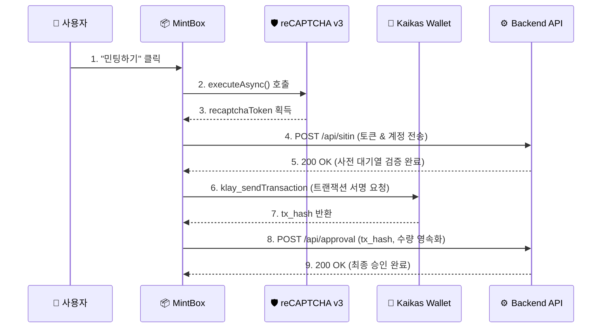

# 📦 MintBox - NFT 민팅 제어 및 온체인 트랜잭션 컴포넌트

VTOK 플랫폼의 핵심 기능인 **NFT 민팅 승인, 실시간 타이머, 구글 reCAPTCHA 봇 방어 및 Kaikas 지갑 서명 인터랙션**을 전담하는 메인 UI 박스 컴포넌트입니다.

---

## 📐 인터랙션 플로우 & 시퀀스

---

## 📄 파일 명세 (`index.js`)
* **상태 관리(State)**:
  * `minting`: 진행 중 여부 (중복 클릭 방지)
  * `collect` / `total`: 누적 민팅 수량 및 목표 총 발행량
  * `left`: 남은 시간 카운트다운 객체 (`days`, `hours`, `minutes`, `seconds`)
  * `balance`: 사용자의 현재 KLAY 보유 잔액
* **주요 메서드**:
  * `getUserBalance(address)`: `klaytn.sendAsync({method: 'klay_getBalance'})` 호출로 지갑 잔액 실시간 조회.
  * `handleMinting()`: reCAPTCHA 검증 ➔ 백엔드 Sitin ➔ Kaikas 트랜잭션 발송 ➔ Approval 영속화 4단계 파이프라인 제어.
