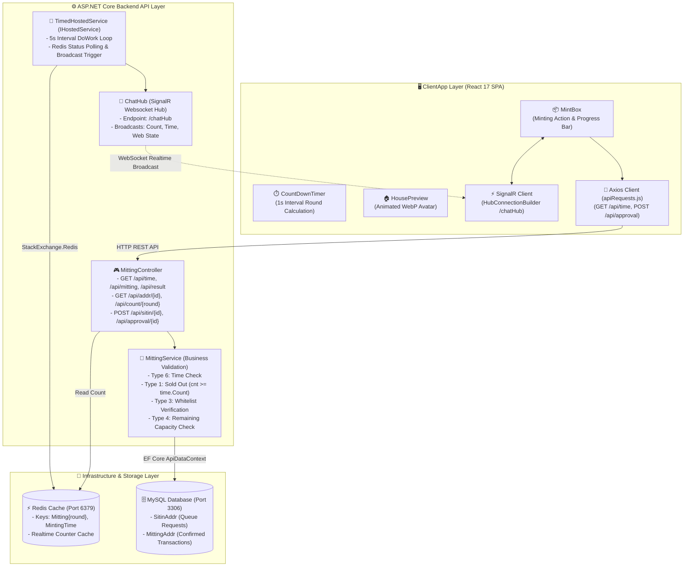

# 🌐 VTOK Publishing Web (VTOK 메인 퍼블리싱 웹 상세 지침서)

VTOK 플랫폼의 메인 브랜딩 웹사이트, 화이트리스트 사전 등록, 카운트다운 타이머, 3D 하우스 애니메이션 및 실시간 민팅 수량 동기화 서비스를 제공하는 풀스택 웹 프로젝트입니다.

---

## 📐 1. 모듈 내부 상세 아키텍처 (Detailed Module Architecture)

---

## 🏗️ 2. 모듈별 파일 단위 상세 명세 (File-by-File Technical Spec)

### 2.1 `ApiControllers/MittingController.cs` (REST API 컨트롤러)
- **`GET /api/time`**: 현재 민팅 라운드 및 남은 시각 조회. `_services.GetTime()`을 호출하여 라운드가 1 미만이면 `"result"` 반환, 그 외 `Time` 객체 반환.
- **`GET /api/mitting`**: `_services.GetMintingTime()` 호출하여 전체 라운드 타임 테이블 및 현재 상태 문자열(`"Start"`, `"End"` 등) 반환.
- **`GET /api/result`**: `_services.GetResult()` 호출하여 민팅 최종 결과 반환.
- **`GET /api/addr/{id}`**: `_services.CheckAddr(id)` 호출하여 특정 지갑 주소(`id`)의 민팅 허용 수량, 이미 진행된 민팅 수량 및 예외 메시지 반환.
- **`GET /api/count/{round}`**: 특정 라운드의 민팅된 총 수량을 반환하고, SignalR 허브를 통해 `Receive("Count", cnt)`로 실시간 카운트 브로드캐스트.
- **`POST /api/sitin/{id}`**: 사전 대기열 등록. Body: `SitinDto` (`{ string Addr, int Count }`).
- **`POST /api/approval/{id}`**: 최종 민팅 트랜잭션 수락 및 수량 차감. Body: `MittingDto` (`{ string Addr, string Tx_id, string Value, int Count, int Round }`). 차감 후 SignalR `Receive("Count", cnt)` 브로드캐스트.

---

### 2.2 `Service/MittingService.cs` (비즈니스 서비스 및 예외 검증 로직)
민팅 요청 시 다음 예외 유형(`transactionModel.Msg` / `MittingAddr.Msg`)에 대한 정밀 검증을 수행합니다:
- **`type: 6`**: `"민팅 시간이 아닙니다."` (`time == null`)
- **`type: 1`**: `"민팅 수량이 모두 소진되었습니다."` (`cnt >= time.Count`)
- **`type: 3`**: `"화이트리스트 대상자가 아닙니다."` (`time.Group == "prive"`일 때 DB 화이트리스트에 조회되지 않는 경우)
- **`type: 4`**: `"내게 남은 수량보다 더 많이 민팅할 수 없습니다."` (`(time.Approvalcount - Resultcount) - sitinDto.Count < 1`)

---

### 2.3 `Service/TimedHostedService.cs` (백그라운드 타이머 호스 티드 서비스)
- `IHostedService`를 상속받아 5초 간격(`TimeSpan.FromSeconds(5)`)으로 `DoWork` 루프를 실행.
- `_redis.GetMintingTime()` 결과에 따라 SignalR 이벤트 처리:
  - `"End"`: `_hubContext.Clients.All.SendAsync("Receive", "Web", "End")` 전송 후 백그라운드 타이머 종료 (`Dispose`).
  - `"Start"`: `_redis.GetTime()` 조회 후 `Receive("Time", response)` 또는 `Receive("Api", "result")` 전송.
  - 기타: `_hubContext.Clients.All.SendAsync("Receive", "Web", mitting)` 전송.

---

### 2.4 `Repository/RedisRepository.cs` (Redis 키 구조)
- `"Mitting" + round` (예: `Mitting1`, `Mitting2`): 해당 라운드에 민팅 완료된 수량 저장.
- `"MintingTime"`: 현재 시스템 민팅 진행 상태 정보 (`Start`, `End`, 대기 상태 등).

---

### 2.5 `Data/ApiDataContext.cs` (EF Core 데이터베이스 컨텍스트)
- **`SitinEntity`** (`SitinAddr` 테이블 매핑): `Id` (PK), `Addr`, `Count`, `Date`
- **`MittingEntity`** (`MittingAddr` 테이블 매핑): `Id` (PK), `Addr`, `Tx_id`, `Value`, `Count`, `Round`, `Date`

---

## 📱 3. ClientApp (React Frontend) 소스 구성

ClientApp 내부의 세부 컴포넌트 사양은 **[ClientApp/README.md](./ClientApp/README.md)** 문서를 확인하시기 바랍니다.
